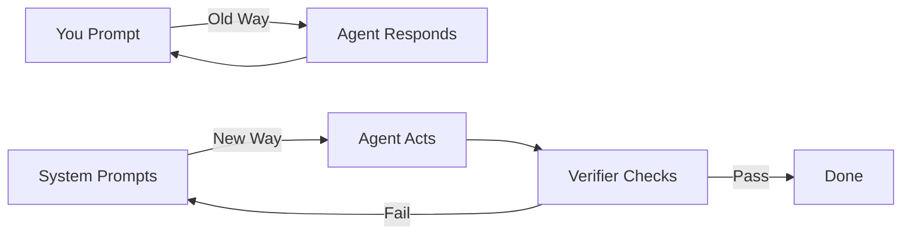
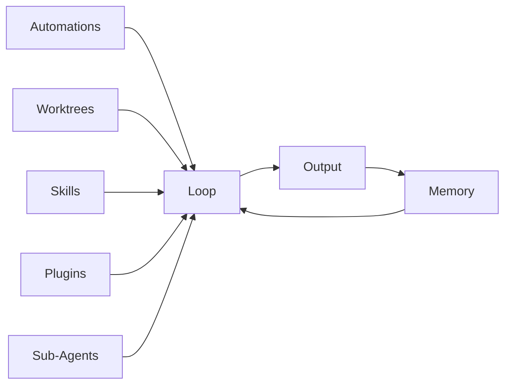

# Everything About Loop Engineering: The Complete Guide (2026)

> **Stop prompting. Start designing.** The complete reference and hands-on course on loop engineering — designing systems that prompt AI coding agents — from absolute beginner to production-ready, in one repo.

[](https://opensource.org/licenses/MIT)
[-orange)](https://github.com/mdayan8/everything-about-loop-engineering/blob/main/HONESTY.md)
[](#table-of-contents)
[](#templates-ready-to-use)
[](#projects-hands-on)
[](#agent-skills-ready-to-use)
[](#llm-wiki-for-ai-agents)
[](https://x.com/mdayan24X)

> **This repo documents a discipline that is approximately two weeks old as of mid-June 2026.** See [HONESTY.md](HONESTY.md) for transparency about the field's age, claim classification, and limitations.

---

## The Big Idea

For two years, the way you worked with AI coding agents was simple: you typed a prompt, read the response, typed another prompt. One turn at a time. You were the human in the loop.

**Loop engineering changes that.** Instead of typing prompts yourself, you design the system that generates them — automatically, on a schedule, with verification, state memory, and sub-agent checking.

> "My job is to write loops."
> — Boris Cherny, head of Claude Code at Anthropic

> "You shouldn't be prompting coding agents anymore. You should be designing loops that prompt your agents."
> — Peter Steinberger (6.5M views)

> "Build the loop. But build it like someone who intends to stay the engineer, not just the person who presses go."
> — Addy Osmani, who coined the term

---

## What is Loop Engineering?

**Loop engineering is replacing yourself as the person who prompts an AI coding agent — designing the system that does it instead.**



| | Prompt Engineering | Loop Engineering |
|--|-------------------|------------------|
| **You do** | Type every prompt | Design the system |
| **Agent does** | Responds to you | Finds work, does it, verifies it |
| **Memory** | Conversation context | External state files |
| **Schedule** | Manual | Automatic (cron, events) |
| **Cost** | Per interaction | Per run (budgetable) |

The term was coined by [Addy Osmani](https://addyosmani.com/blog/loop-engineering/) on June 8, 2026. The technique originated with [Geoffrey Huntley's](https://ghuntley.com/ralph/) "Ralph" loop in July 2025.

---

## Who This Is For

| You Are | What You Get |
|---------|-------------|
| **Developer** using Claude Code, Codex, Cursor | Move from interactive prompting to autonomous loops |
| **Tech lead** evaluating loop engineering | Understand the patterns, costs, and risks before adopting |
| **Curious engineer** following AI trends | Structured, honest explanation of a 6.5M-view trend |
| **AI agent builder** designing orchestration | Templates, patterns, and a knowledge base to plug into |
| **Team lead** looking to automate workflows | 5 runnable projects you can deploy today |

---

## What You'll Learn

```
Beginner          Intermediate          Advanced
────────          ────────────          ────────
Module 00         Module 05             Module 09
  ↓                 ↓                     ↓
Module 01         Module 06             Module 10
  ↓                 ↓                   (Capstone)
Module 02         Module 07
  ↓                 ↓
Module 03         Module 08
  ↓              (Skeptics)
Module 04
(First Loop)
```

- What AI coding agents are and how they differ from chatbots
- What loop engineering is, where it came from, and why it matters
- The six building blocks: automations, worktrees, skills, plugins, sub-agents, memory
- How to build your first loop hands-on
- The maturity model: L1 → L2 → L3
- Six production patterns with cost estimates
- What goes wrong: failure modes and pre-flight checklists
- The skeptics' case — presented fairly
- Advanced topics: multi-loop coordination, token economics, beyond coding

---

## Quick Start (2 Minutes)

```bash
# Clone
git clone https://github.com/mdayan8/everything-about-loop-engineering.git
cd everything-about-loop-engineering

# Read the honesty disclaimer
cat HONESTY.md

# Start learning
open modules/00-prerequisites/README.md
```

**Or jump straight to building:** [Project 01: Hello Loop](projects/project-01-hello-loop/) — your first loop in 5 minutes.

---

## Table of Contents

### Core Modules (Start Here)

| # | Module | What You Learn | Time |
|---|--------|---------------|------|
| 00 | [Prerequisites](modules/00-prerequisites/README.md) | What you need before starting | 5 min |
| 01 | [What is an AI Coding Agent](modules/01-what-is-an-ai-coding-agent/README.md) | Agents vs chatbots, prompts | 10 min |
| 02 | [What is Loop Engineering](modules/02-what-is-loop-engineering/README.md) | Timeline, definition, thermostat analogy | 15 min |
| 03 | [The Five Building Blocks](modules/03-the-five-building-blocks/README.md) | Automations, worktrees, skills, plugins, sub-agents, memory | 30 min |
| 04 | [Building Your First Loop](modules/04-building-your-first-loop/README.md) | Step-by-step Changelog Drafter | 30 min |

### Production & Reference

| # | Module | What You Learn | Time |
|---|--------|---------------|------|
| 05 | [The Maturity Model](modules/05-the-maturity-model/README.md) | L1 → L2 → L3 with readiness rubric | 15 min |
| 06 | [Production Patterns](modules/06-production-patterns/README.md) | Six battle-tested patterns | 20 min |
| 07 | [What Goes Wrong](modules/07-what-goes-wrong/README.md) | Failure modes, case studies, checklists | 20 min |
| 08 | [The Skeptics' Case](modules/08-the-skeptics-case/README.md) | The "it's just a while loop" argument | 15 min |

### Advanced

| # | Module | What You Learn | Time |
|---|--------|---------------|------|
| 09 | [Advanced Topics](modules/09-advanced-topics/README.md) | Multi-loop coordination, token economics | 20 min |
| 10 | [Capstone Project](modules/10-capstone-project/README.md) | Design a full loop for a real repo | 60 min |

### Reference Materials

| File | What It Is |
|------|-----------|
| [GLOSSARY.md](GLOSSARY.md) | Every term defined, alphabetized |
| [FAQ.md](FAQ.md) | 15+ questions answered |
| [RESOURCES.md](RESOURCES.md) | Every source attributed |
| [CONTRIBUTING.md](CONTRIBUTING.md) | How to contribute |
| [HONESTY.md](HONESTY.md) | The field's age and limitations |

---

## Projects: Hands-On

**Build real loops. Deploy them. See them work.**

| # | Project | Difficulty | Cost | What You Build |
|---|---------|-----------|------|----------------|
| 01 | [Hello Loop](projects/project-01-hello-loop/) | Beginner | ~$0.01 | Your first L1 report loop |
| 02 | [Dependency Checker](projects/project-02-dependency-checker/) | Beginner | ~$0.05 | Outdated dependency scanner |
| 03 | [Security Scanner](projects/project-03-security-scanner/) | Intermediate | ~$0.10 | Hardcoded secrets detector |
| 04 | [Doc Generator](projects/project-04-doc-generator/) | Intermediate | ~$0.15 | API docs from source code |
| 05 | [Multi-Agent Auditor](projects/project-05-multi-agent-auditor/) | Advanced | ~$0.30 | 4 sub-agents in parallel |

Each project includes: README, SKILL.md, prompt.md, STATE.md, and GitHub Actions config.

**Quick start (Project 01):**
```bash
cd /path/to/your-repo
cp -r projects/project-01-hello-loop/* .
mkdir -p reports
claude --prompt-file prompt.md
cat reports/hello-loop-report.md
```

---

## Templates (Ready to Use)

| Template | Purpose | When to Use |
|----------|---------|-------------|
| [SKILL.md.template](templates/SKILL.md.template) | Project conventions for agents | Every project |
| [VISION.md.template](templates/VISION.md.template) | What agents should build toward | Every project |
| [AGENTS.md.template](templates/AGENTS.md.template) | House rules for agent behavior | Every project |
| [STATE.md.template](templates/STATE.md.template) | Persistent memory across runs | Every loop |
| [First Loop Design Canvas](templates/first-loop-design-canvas.md) | Plan your first loop | First loop |
| [Loop Design Checklist](templates/loop-design-checklist.md) | Pre-launch safety check | Before L2+ |
| [Claude Code Examples](templates/claude-code-automation.example.md) | Claude Code configs | Claude Code users |
| [Codex Examples](templates/codex-automation.example.md) | Codex configs | Codex users |
| [Sub-Agent Definition](templates/subagent-definition.toml.template) | Maker/checker pairs | Sub-agent loops |

---

## Agent Skills (Ready to Use)

| Skill | Purpose | When to Load |
|-------|---------|-------------|
| [Agent Onboarding](skills/agent-onboarding.md) | Onboards any agent to this repo | First visit |
| [Daily Triage](skills/daily-triage.md) | Issue/PR categorization config | Building triage loop |
| [Changelog Drafter](skills/changelog-drafter.md) | Git history changelog config | Building changelog loop |
| [PR Babysitter](skills/pr-babysitter.md) | PR monitoring config | Building PR monitor |
| [Dependency Sweeper](skills/dependency-sweeper.md) | Dependency update config | Building dep updater |
| [Code Quality Guardian](skills/code-quality-guardian.md) | Multi-agent audit config | Building quality loop |
| [Loop Designer](skills/loop-designer.md) | Design new loops interactively | Planning new loop |

---

## LLM Wiki (For AI Agents)

A structured knowledge base any AI agent can plug into. Copy `llm-wiki/` into your agent's knowledge base.

| File | Purpose | When to Read |
|------|---------|-------------|
| [INDEX.md](llm-wiki/INDEX.md) | Master concept map | First — always |
| [CONCEPTS.md](llm-wiki/CONCEPTS.md) | All concepts defined | Need to understand something |
| [TERMINOLOGY.md](llm-wiki/TERMINOLOGY.md) | Every term alphabetized | Unfamiliar term |
| [PATTERNS.md](llm-wiki/PATTERNS.md) | All patterns with configs | Building a loop |
| [FAILURE-MODES.md](llm-wiki/FAILURE-MODES.md) | What goes wrong | Before L2+ |
| [TEMPLATES-GUIDE.md](llm-wiki/TEMPLATES-GUIDE.md) | How to use templates | Filling out templates |
| [AGENT-ONBOARDING.md](llm-wiki/AGENT-ONBOARDING.md) | Agent behavior rules | Agent starts working |
| [QUICK-REFERENCE.md](llm-wiki/QUICK-REFERENCE.md) | One-page cheat sheet | Fast answer needed |

```bash
# Add to your agent's knowledge base
cp -r llm-wiki/ /path/to/your-agent/knowledge/loop-engineering/
```

---

## The Maturity Model

```
L1: Report Only          L2: Assisted            L3: Unattended
──────────────          ────────────            ──────────────
Reads & writes          Proposes changes        Commits & deploys
Human decides           Human merges            Autonomous
Low risk                Medium risk             High risk
Most loops stay here    After L1 proven         Few tasks earn this
```

| Tier | What It Does | When to Advance |
|------|-------------|----------------|
| **L1** | Report only — changes nothing | Stay here long |
| **L2** | Proposes changes — human merges | After 1+ week L1 |
| **L3** | Autonomous — commits/merges | After 2+ weeks L2 |

---

## The Six Production Patterns

| Pattern | Cadence | Cost | Start At | What It Does |
|---------|---------|------|----------|-------------|
| [Daily Triage](modules/06-production-patterns/README.md#daily-triage) | 1x/day | Low | L1 | Categorizes issues & PRs |
| [Changelog Drafter](modules/06-production-patterns/README.md#changelog-drafter) | Daily | Low | L1 | Drafts changelogs |
| [Post-Merge Cleanup](modules/06-production-patterns/README.md#post-merge-cleanup) | 1-6h | Low | L1 | Cleans up after merges |
| [Dependency Sweeper](modules/06-production-patterns/README.md#dependency-sweeper) | 6h-1d | Medium | L2 | Proposes dep updates |
| [PR Babysitter](modules/06-production-patterns/README.md#pr-babysitter) | 5-15min | High | L1 | Monitors PRs |
| [CI Sweeper](modules/06-production-patterns/README.md#ci-sweeper) | 5-15min | V.High | L2 | Checks CI status |

---

## The Six Building Blocks



| Block | What It Does | Skip If |
|-------|-------------|---------|
| **Automations** | Schedule/trigger the loop | You want manual runs only |
| **Worktrees** | Isolate parallel agents | Single loop only |
| **Skills** | Project conventions | Agent can figure it out |
| **Plugins** | External tools | File-only operations |
| **Sub-agents** | Independent verification | L1 with human review |
| **Memory** | Persistent state | Single-run task |

---

## Real-World Results

We ran a multi-sub-agent loop on this repo itself:

| Check | Result |
|-------|--------|
| Link Check | 145/149 valid — 4 broken links found and fixed |
| Structure Audit | 41/41 required files present |
| Content Completeness | 8/11 modules fully complete |
| Glossary Consistency | 6 terms need standardization |

**Cost:** ~$0.20 for the full 4-sub-agent audit. See [examples/code-quality-guardian/](examples/code-quality-guardian/).

---

## Pre-Flight Checklist

Before any L2+ loop:

- [ ] Verifier sub-agent or objective success criteria
- [ ] Spend cap set (daily + per-run)
- [ ] Kill switch tested
- [ ] Scope narrow enough for current tier
- [ ] Human review point defined
- [ ] Automated verification (tests, linting)
- [ ] L1 running for 1+ week
- [ ] Failure modes documented
- [ ] Rollback plan exists

---

## The Skeptics' Case

The strongest objection: **"It's just a `while` loop with an LLM call."**

Fair. The control-loop shape is decades old. What's arguably new is the scaffolding — native scheduling, worktrees, sub-agents, and memory — shipping simultaneously inside coding agent tools.

**The honest answer:** the shape isn't new; the integration is. Whether that warrants a new term is opinion. Whether the pattern works is not.

See [Module 08](modules/08-the-skeptics-case/README.md) for the full argument.

---

## Key Quotes

> "My job is to write loops." — **Boris Cherny**, head of Claude Code at Anthropic

> "You shouldn't be prompting coding agents anymore. You should be designing loops that prompt your agents." — **Peter Steinberger** (6.5M views)

> "Build the loop. But build it like someone who intends to stay the engineer, not just the person who presses go." — **Addy Osmani**, who coined "loop engineering"

---

## Repository Structure

```
everything-about-loop-engineering/
├── README.md                    ← You are here
├── LICENSE                      MIT
├── CONTRIBUTING.md              How to contribute
├── HONESTY.md                   Field transparency
├── GLOSSARY.md                  Term definitions
├── FAQ.md                       15+ questions answered
├── RESOURCES.md                 Attributed sources
│
├── modules/                     11 learning modules
│   ├── 00-prerequisites/
│   ├── 01-what-is-an-ai-coding-agent/
│   ├── 02-what-is-loop-engineering/
│   ├── 03-the-five-building-blocks/
│   ├── 04-building-your-first-loop/
│   ├── 05-the-maturity-model/
│   ├── 06-production-patterns/
│   ├── 07-what-goes-wrong/
│   ├── 08-the-skeptics-case/
│   ├── 09-advanced-topics/
│   └── 10-capstone-project/
│
├── templates/                   9 fill-in-the-blank templates
├── examples/                    3 worked examples
├── skills/                      8 agent skill files
├── projects/                    5 hands-on projects
│   ├── project-01-hello-loop/
│   ├── project-02-dependency-checker/
│   ├── project-03-security-scanner/
│   ├── project-04-doc-generator/
│   └── project-05-multi-agent-auditor/
│
├── llm-wiki/                    Knowledge base for AI agents
│   ├── INDEX.md
│   ├── CONCEPTS.md
│   ├── TERMINOLOGY.md
│   ├── PATTERNS.md
│   ├── FAILURE-MODES.md
│   ├── TEMPLATES-GUIDE.md
│   ├── AGENT-ONBOARDING.md
│   └── QUICK-REFERENCE.md
│
└── assets/diagrams/             11 Mermaid diagram sources
```

**81 files. 11 modules. 9 templates. 5 projects. 8 skills. 9 wiki files. Everything you need.**

---

## Frequently Asked Questions

### Is loop engineering just a while loop?

Partially. The shape is decades old. What's new is the scaffolding that shipped inside Claude Code and Codex: native scheduling, worktrees, sub-agents, and cross-session memory. See [Module 08](modules/08-the-skeptics-case/README.md).

### How much do loops cost?

| Pattern | Monthly Cost |
|---------|-------------|
| Daily Triage (L1) | $1.50–$6.00 |
| Changelog Drafter (L1) | $1.50–$4.50 |
| PR Babysitter (L1) | $15–$60 |
| CI Sweeper (L2) | $30–$150 |

### Can a loop damage my codebase?

L1 loops cannot — they only write reports. L2 proposes changes you review. L3 is autonomous but requires proven guardrails. See [Module 07](modules/07-what-goes-wrong/README.md).

### Which coding agent should I use?

Claude Code and Codex have native loop engineering features. The concepts apply to any agent with filesystem access. See [FAQ.md](FAQ.md).

### What is the Ralph Wiggum loop?

The original technique: `while : ; do cat PROMPT.md | claude ; done`. Created by Geoffrey Huntley in July 2025. See [Module 02](modules/02-what-is-loop-engineering/README.md).

---

## Connect

- **X (Twitter):** [@mdayan24X](https://x.com/mdayan24X)
- **GitHub:** [mdayan8](https://github.com/mdayan8)

---

## Contributing

See [CONTRIBUTING.md](CONTRIBUTING.md). Corrections, experience reports, and new patterns welcome.

---

## License

[MIT](LICENSE)

---

*This repo documents a discipline that is approximately two weeks old. It is not an established field with years of best practice. Treat content here as a snapshot, not a final answer. See [HONESTY.md](HONESTY.md).*

*"Loop engineering" is also an unrelated, older term in structural biology (re-engineering flexible loop regions of enzymes like Cas9). That field has nothing to do with this repository.*
