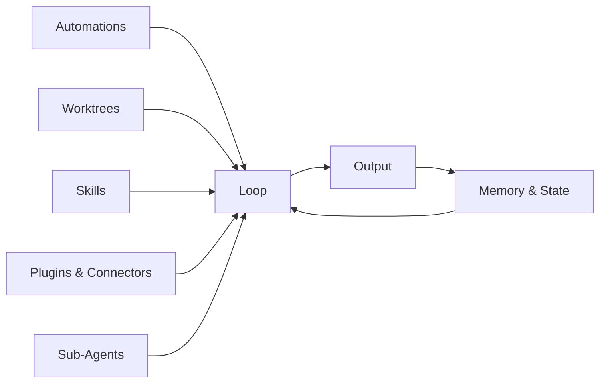
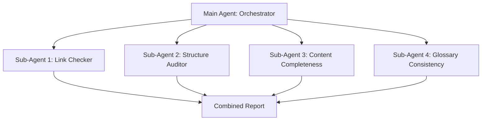

# Everything About Loop Engineering: The Complete Guide (2026)

> **The complete reference and hands-on course on loop engineering — designing systems that prompt AI coding agents — from absolute beginner to production-ready, in one repo.**


-orange)


[](https://x.com/mdayan24X)

> **This repo documents a discipline that is approximately two weeks old as of mid-June 2026.** See [HONESTY.md](HONESTY.md) for transparency about the field's age, claim classification, and limitations.

---

## What is Loop Engineering? (Definition)

**Loop engineering is the practice of designing the system that prompts an AI coding agent, rather than typing each prompt yourself.** It is the shift from *you* prompting the agent to *a system* prompting the agent.

When you type prompts into Claude Code or Codex one at a time, you are the human in the loop. Loop engineering removes you from that role — not by replacing you, but by designing the automation, verification, and state management that lets the agent run autonomously.

The term was coined by [Addy Osmani](https://addyosmani.com/blog/loop-engineering/) (Google Chrome engineering lead) on June 8, 2026, building on work by:

- **Boris Cherny** (head of Claude Code at Anthropic): "My job is to write loops."
- **Peter Steinberger** (founder of OpenClaw, now at OpenAI): "You shouldn't be prompting coding agents anymore. You should be designing loops that prompt your agents."
- **Geoffrey Huntley** (independent engineer): Created the original [Ralph Wiggum loop](https://ghuntley.com/ralph/) technique in July 2025

> "Build the loop. But build it like someone who intends to stay the engineer, not just the person who presses go."
> — Addy Osmani

---

## Prompt Engineering vs. Loop Engineering

| Dimension | Prompt Engineering | Loop Engineering |
|-----------|-------------------|------------------|
| **Unit of work** | One turn | Entire autonomous run |
| **Who prompts** | You, every time | The system, automatically |
| **Memory** | Conversation context | External state files (STATE.md) |
| **Verification** | You check the output | Sub-agents + automated checks |
| **Scheduling** | Manual | Cron, events, or built-in |
| **Cost model** | Per interaction | Per loop run (budgetable) |

Prompt engineering asks: *"What should I say to get the best output?"*
Loop engineering asks: *"What system should I build so the agent finds the work, does it, verifies it, and remembers what it did — without me in the loop at all?"*

---

## The Ralph Loop: Where It Started

The foundational technique is the **Ralph Wiggum loop**, created by Geoffrey Huntley in July 2025:

```bash
while : ; do cat PROMPT.md | claude ; done
```

That's it. An infinite loop that repeatedly feeds the same prompt to a coding agent. Progress lives in files and git history, not in the model's context window. When the context fills up, a fresh agent picks up where the last one left off.

Huntley ran this technique unattended for three months. The agent built a small esoteric programming language called CURSED as a stress test. In January 2026, he published ["everything is a ralph loop"](https://ghuntley.com/loop/), arguing the pattern was becoming the default way to work.

By mid-2026, Anthropic formalized the pattern into an official Claude Code plugin (`/ralph-loop`, `/cancel-ralph`), and both Claude Code and Codex shipped native support for the building blocks that make loops practical: scheduling, worktrees, sub-agents, and cross-session memory.

---

## Who This Is For

- **Developers** using AI coding agents (Claude Code, Codex, Cursor, Windsurf) who want to move beyond interactive prompting
- **Tech leads** evaluating whether loop engineering is worth adopting on their team
- **Curious engineers** who want to understand a trend that reached 2M–6.5M views in its first week
- **Anyone** who wants a structured, honest, beginner-to-advanced resource on designing AI agent systems

---

## What You'll Learn

- What AI coding agents are and how they differ from chatbots ([Module 01](modules/01-what-is-an-ai-coding-agent/README.md))
- What loop engineering is, where it came from, and why it matters ([Module 02](modules/02-what-is-loop-engineering/README.md))
- The six building blocks: automations, worktrees, skills, plugins, sub-agents, memory ([Module 03](modules/03-the-five-building-blocks/README.md))
- How to build your first loop hands-on ([Module 04](modules/04-building-your-first-loop/README.md))
- The maturity model: L1 → L2 → L3 ([Module 05](modules/05-the-maturity-model/README.md))
- Six production patterns with cost estimates ([Module 06](modules/06-production-patterns/README.md))
- What goes wrong: failure modes and pre-flight checklists ([Module 07](modules/07-what-goes-wrong/README.md))
- The skeptics' case — presented fairly ([Module 08](modules/08-the-skeptics-case/README.md))
- Advanced topics: multi-loop coordination, token economics, beyond coding ([Module 09](modules/09-advanced-topics/README.md))

---

## Quick Start

```bash
# Clone the repo
git clone https://github.com/your-username/everything-about-loop-engineering.git
cd everything-about-loop-engineering

# Read the honesty disclaimer first
cat HONESTY.md

# Start at Module 00
open modules/00-prerequisites/README.md
```

**Start at [Module 00: Prerequisites](modules/00-prerequisites/README.md)** and go in order through Module 04. After that, modules are reference material you can return to as needed.

---

## For AI Agents: Plug In and Learn

**Any coding agent can use this repository.** The `llm-wiki/` directory is a structured knowledge base designed for AI ingestion.

### Quick Onboarding for Agents

1. Read `llm-wiki/AGENT-ONBOARDING.md` — your rules for this repo
2. Read `llm-wiki/INDEX.md` — master map of all concepts
3. Read `llm-wiki/QUICK-REFERENCE.md` — one-page cheat sheet
4. Load `skills/agent-onboarding.md` if your agent supports skills

### For Agent Developers

To add loop engineering knowledge to your coding agent:

```bash
# Copy the LLM Wiki into your agent's knowledge base
cp -r llm-wiki/ /path/to/your-agent/knowledge/loop-engineering/

# Point your agent's system prompt to the onboarding file
# Example: "When working on loop engineering tasks, read 
# /knowledge/loop-engineering/AGENT-ONBOARDING.md first"
```

The wiki is plain Markdown — no special dependencies. It works with any LLM.

---

## Table of Contents

### Core Modules (Start Here)

| Module | Topic | What You Learn |
|--------|-------|----------------|
| [00 — Prerequisites](modules/00-prerequisites/README.md) | Setup | What you need before starting — basic git, CLI, and agent access |
| [01 — What is an AI Coding Agent](modules/01-what-is-an-ai-coding-agent/README.md) | Fundamentals | Agents vs chatbots, prompts, and prompt engineering |
| [02 — What is Loop Engineering](modules/02-what-is-loop-engineering/README.md) | The Discipline | Full timeline, core definition, the thermostat analogy |
| [03 — The Five Building Blocks](modules/03-the-five-building-blocks/README.md) | Components | Automations, worktrees, skills, plugins, sub-agents, memory |
| [04 — Building Your First Loop](modules/04-building-your-first-loop/README.md) | Hands-On | Step-by-step Changelog Drafter walkthrough |

### Production & Reference

| Module | Topic | What You Learn |
|--------|-------|----------------|
| [05 — The Maturity Model](modules/05-the-maturity-model/README.md) | Tiers | L1 → L2 → L3 with readiness rubric |
| [06 — Production Patterns](modules/06-production-patterns/README.md) | Patterns | Six patterns: Daily Triage, PR Babysitter, CI Sweeper, and more |
| [07 — What Goes Wrong](modules/07-what-goes-wrong/README.md) | Failure Modes | Six failure modes, password-default case study, pre-flight checklist |
| [08 — The Skeptics' Case](modules/08-the-skeptics-case/README.md) | Counterarguments | The "it's just a while loop" argument, fairly presented |

### Advanced

| Module | Topic | What You Learn |
|--------|-------|----------------|
| [09 — Advanced Topics](modules/09-advanced-topics/README.md) | Advanced | Multi-loop coordination, token economics, beyond coding |
| [10 — Capstone Project](modules/10-capstone-project/README.md) | Project | Design and document a full L1 loop for a real repo |

### Reference Materials

| File | Description |
|------|-------------|
| [GLOSSARY.md](GLOSSARY.md) | Alphabetized definitions of all terms (loop engineering, worktree, sub-agent, etc.) |
| [FAQ.md](FAQ.md) | Frequently asked questions — getting started, safety, cost, tooling, philosophy |
| [RESOURCES.md](RESOURCES.md) | Attributed sources: Huntley, Cherny, Steinberger, Osmani |
| [CONTRIBUTING.md](CONTRIBUTING.md) | How to contribute corrections, case studies, and new patterns |
| [HONESTY.md](HONESTY.md) | Transparency about the field's age and claim classification |

### Templates (Ready to Use)

| Template | Purpose |
|----------|---------|
| [SKILL.md.template](templates/SKILL.md.template) | Fill-in-the-blank skill file for project conventions |
| [VISION.md.template](templates/VISION.md.template) | Agent vision anchor — what the project is building toward |
| [AGENTS.md.template](templates/AGENTS.md.template) | House rules for agent behavior in a repo |
| [STATE.md.template](templates/STATE.md.template) | Memory/spine file: tried, passed, still open, last run |
| [First Loop Design Canvas](templates/first-loop-design-canvas.md) | One-page worksheet for planning your first loop |
| [Loop Design Checklist](templates/loop-design-checklist.md) | Pre-launch checklist before enabling L2+ loops |
| [Claude Code Examples](templates/claude-code-automation.example.md) | Realistic Claude Code automation configurations |
| [Codex Examples](templates/codex-automation.example.md) | Realistic Codex automation configurations |
| [Sub-Agent Definition](templates/subagent-definition.toml.template) | Maker/checker pair definition template |

### Worked Examples

| Example | Pattern | Maturity | Description |
|---------|---------|----------|-------------|
| [Daily Triage](examples/daily-triage/) | Daily Triage | L1 | Categorizes issues and PRs, writes a daily snapshot |
| [Changelog Drafter](examples/changelog-drafter/) | Changelog Drafter | L1 | Drafts a changelog from git history |
| [Code Quality Guardian](examples/code-quality-guardian/) | Multi-Sub-Agent | L1 | Four independent sub-agents verify quality in parallel |

### Agent Skills (Ready to Use)

| Skill | Purpose | When to Load |
|-------|---------|-------------|
| [Agent Onboarding](skills/agent-onboarding.md) | Onboards any coding agent to this repo | First time working here |
| [Daily Triage](skills/daily-triage.md) | Config for the Daily Triage pattern | Building a triage loop |
| [Changelog Drafter](skills/changelog-drafter.md) | Config for the Changelog Drafter pattern | Building a changelog loop |
| [PR Babysitter](skills/pr-babysitter.md) | Config for the PR Babysitter pattern | Building a PR monitoring loop |
| [Dependency Sweeper](skills/dependency-sweeper.md) | Config for the Dependency Sweeper pattern | Building a dependency update loop |
| [Code Quality Guardian](skills/code-quality-guardian.md) | Config for multi-sub-agent quality audits | Building a quality audit loop |
| [Loop Designer](skills/loop-designer.md) | Walks through designing a new loop | Planning a new loop |

### LLM Wiki (For AI Agents)

A structured knowledge base designed for AI agents to ingest. Any coding agent can read these files to understand loop engineering without human explanation.

| File | Purpose | When to Read |
|------|---------|-------------|
| [INDEX.md](llm-wiki/INDEX.md) | Master index of all concepts | First — always |
| [CONCEPTS.md](llm-wiki/CONCEPTS.md) | Core concepts with definitions | When you need to understand what something means |
| [TERMINOLOGY.md](llm-wiki/TERMINOLOGY.md) | Every term, its definition, and usage | When you encounter an unfamiliar term |
| [PATTERNS.md](llm-wiki/PATTERNS.md) | All production patterns with configs | When you need to build or modify a loop |
| [FAILURE-MODES.md](llm-wiki/FAILURE-MODES.md) | What goes wrong and how to prevent it | Before enabling any L2+ loop |
| [TEMPLATES-GUIDE.md](llm-wiki/TEMPLATES-GUIDE.md) | How to use every template | When filling out templates |
| [AGENT-ONBOARDING.md](llm-wiki/AGENT-ONBOARDING.md) | How any coding agent should behave here | First thing an agent reads |
| [QUICK-REFERENCE.md](llm-wiki/QUICK-REFERENCE.md) | One-page cheat sheet | When you need a fast answer |

---

## The Maturity Model

| Tier | Name | What It Does | When to Use |
|------|------|-------------|-------------|
| **L1** | Report Only | Reads, observes, writes down — changes nothing | Most loops, most of the time |
| **L2** | Assisted | Proposes changes; human merges | When L1 is proven and scope is tight |
| **L3** | Unattended | Commits/merges/deploys autonomously | Rarely. Few tasks earn this. |

**Advice:** Most loops should stay at L1 far longer than feels necessary. Few tasks ever earn L3.

---

## The Six Production Patterns

| Pattern | Cadence | Starting Tier | Token Cost |
|---------|---------|---------------|------------|
| [Daily Triage](modules/06-production-patterns/README.md#daily-triage) | Once/day | L1 | Low |
| [PR Babysitter](modules/06-production-patterns/README.md#pr-babysitter) | Every 5–15 min | L1 | High |
| [CI Sweeper](modules/06-production-patterns/README.md#ci-sweeper) | Every 5–15 min | L2 | Very high |
| [Dependency Sweeper](modules/06-production-patterns/README.md#dependency-sweeper) | 6h–1 day | L2 | Medium |
| [Changelog Drafter](modules/06-production-patterns/README.md#changelog-drafter) | Daily/release | L1 | Low |
| [Post-Merge Cleanup](modules/06-production-patterns/README.md#post-merge-cleanup) | 1–6h | L1 | Low |

---

## The Six Building Blocks



| Block | What It Does |
|-------|-------------|
| **Automations** | Triggers the loop on a schedule or event |
| **Worktrees** | Isolates parallel agents so they don't collide |
| **Skills** | Gives the agent project context without re-derivation |
| **Plugins & Connectors** | Lets the agent reach real tools beyond the filesystem |
| **Sub-Agents** | Verifies the agent's work with an independent checker |
| **Memory & State** | Persists information across agent runs |

---

## Real-World Results: Code Quality Guardian

We ran a multi-sub-agent loop on this repository itself to demonstrate the pattern. Four independent sub-agents checked the repo in parallel:



### Results

| Check | Status | Findings |
|-------|--------|----------|
| **Link Check** | 145/149 valid | 4 broken links found and fixed |
| **Structure Audit** | 41/41 required files | All required files present |
| **Content Completeness** | 8/11 fully complete | 3 modules need Mermaid diagrams |
| **Glossary Consistency** | 1/7 terms consistent | 6 terms have variant spellings |

**Key findings:**
- 4 broken internal links (fixed): incorrect relative paths and placeholder GitHub URLs
- All 41 required files present in the correct structure
- 3 modules (04, 05, 06) are fully complete with all 6 required elements
- Terms like "sub-agent" vs "subagent" and "Worktree" vs "worktree" have inconsistent capitalization across files

**Cost:** ~$0.20 for the full 4-sub-agent audit. See [examples/code-quality-guardian/](examples/code-quality-guardian/) for the complete setup.

---

## Key Quotes

> "My job is to write loops."
> — Boris Cherny, head of Claude Code at Anthropic (June 2, 2026)

> "You shouldn't be prompting coding agents anymore. You should be designing loops that prompt your agents."
> — Peter Steinberger (June 7, 2026)

> "Build the loop. But build it like someone who intends to stay the engineer, not just the person who presses go."
> — Addy Osmani (June 8, 2026)

---

## Frequently Asked Questions

### Is loop engineering just a while loop with an LLM?

Partially — yes. The skeptics' case is covered fairly in [Module 08](modules/08-the-skeptics-case/README.md). The shape (control loop) is decades old. What's arguably new is the scaffolding (native scheduling, native worktrees, native sub-agents, native cross-session memory) that shipped simultaneously inside coding agent tools.

### How much do loops cost in tokens?

It depends on cadence, scope, and whether sub-agents are used. A daily triage loop (L1) costs ~$1.50–$6.00/month. A PR babysitter running every 5 minutes with sub-agent verification costs ~$15–$60/month. See [Module 09: Token Economics](modules/09-advanced-topics/token-economics.md) for budgeting guidance.

### Can a loop damage my codebase?

L1 loops cannot — they only write reports. L2 loops propose changes but you review them before merging. L3 loops can modify code autonomously, which is why the [pre-flight checklist](templates/loop-design-checklist.md) exists. Never enable L3 without proven guardrails.

### Which coding agent should I use?

This repo is tool-agnostic but references Claude Code and OpenAI Codex most often, since those are the two products where the core loop engineering features shipped natively as of mid-2026. The concepts apply to any agent with filesystem access and scheduling capability.

### What is the Ralph Wiggum loop?

The Ralph loop is the original technique for loop engineering, published by Geoffrey Huntley in July 2025. It wraps a coding agent in a bash `while true` loop, pipes in a prompt file, and lets it run unattended with state persisted to disk. Named after the Simpsons character. See [Module 02](modules/02-what-is-loop-engineering/README.md) for the full timeline.

---

## Repository Structure

```
everything-about-loop-engineering/
├── README.md                    # You are here
├── LICENSE                      # MIT
├── CONTRIBUTING.md              # How to contribute
├── HONESTY.md                   # Transparency about the field
├── GLOSSARY.md                  # Term definitions
├── FAQ.md                       # Frequently asked questions
├── RESOURCES.md                 # Attributed sources
├── modules/                     # 11 learning modules
│   ├── 00-prerequisites/
│   ├── 01-what-is-an-ai-coding-agent/
│   ├── 02-what-is-loop-engineering/
│   ├── 03-the-five-building-blocks/
│   ├── 04-building-your-first-loop/
│   ├── 05-the-maturity-model/
│   ├── 06-production-patterns/
│   ├── 07-what-goes-wrong/
│   ├── 08-the-skeptics-case/
│   ├── 09-advanced-topics/
│   └── 10-capstone-project/
├── templates/                   # 9 fill-in-the-blank templates
├── examples/                    # 3 worked examples
│   ├── daily-triage/
│   ├── changelog-drafter/
│   └── code-quality-guardian/
├── skills/                      # 7 agent skill files
│   ├── agent-onboarding.md
│   ├── daily-triage.md
│   ├── changelog-drafter.md
│   ├── pr-babysitter.md
│   ├── dependency-sweeper.md
│   ├── code-quality-guardian.md
│   └── loop-designer.md
├── llm-wiki/                    # Knowledge base for AI agents
│   ├── INDEX.md
│   ├── CONCEPTS.md
│   ├── TERMINOLOGY.md
│   ├── PATTERNS.md
│   ├── FAILURE-MODES.md
│   ├── TEMPLATES-GUIDE.md
│   ├── AGENT-ONBOARDING.md
│   └── QUICK-REFERENCE.md
└── assets/diagrams/             # 11 Mermaid diagram sources
```

---

## Contributing

See [CONTRIBUTING.md](CONTRIBUTING.md). Contributions of corrections, real-world experience reports, and new patterns are welcome.

---

## License

[MIT](LICENSE)

---

## Connect

- **X (Twitter):** [@mdayan24X](https://x.com/mdayan24X)
- **GitHub:** [mdayan8](https://github.com/mdayan8)

---

*This repo documents a discipline that is approximately two weeks old. It is not an established field with years of best practice. Treat content here as a snapshot, not a final answer. See [HONESTY.md](HONESTY.md).*

*"Loop engineering" is also an unrelated, older term in structural biology (re-engineering flexible loop regions of enzymes like Cas9). That field has nothing to do with this repository.*
