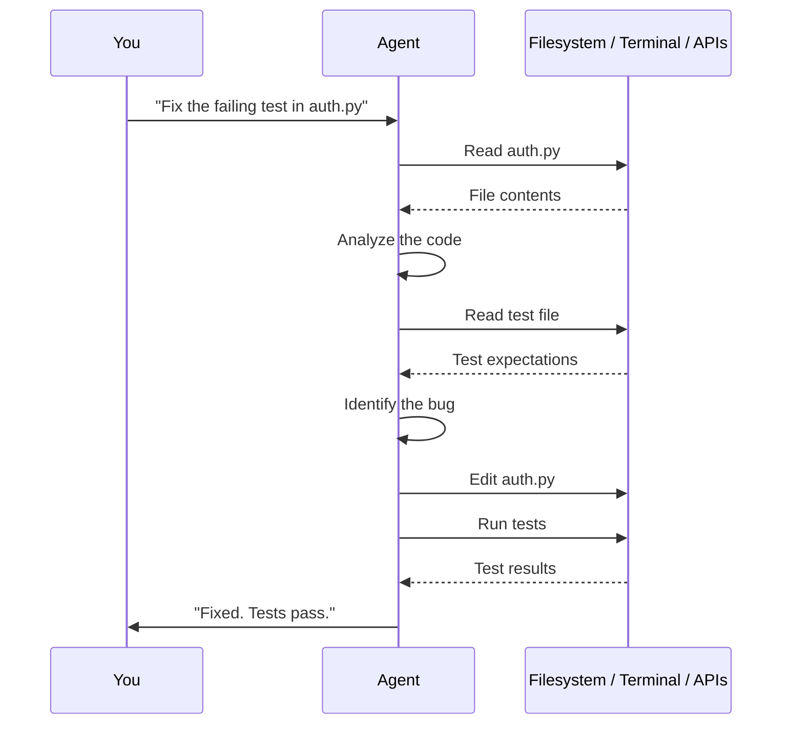

# Agent Loop Diagram

```mermaid
sequenceDiagram
    participant You
    participant Agent
    participant Tools as Filesystem / Terminal / APIs

    You->>Agent: "Fix the failing test in auth.py"
    Agent->>Tools: Read auth.py
    Tools-->>Agent: File contents
    Agent->>Agent: Analyze the code
    Agent->>Tools: Read test file
    Tools-->>Agent: Test expectations
    Agent->>Agent: Identify the bug
    Agent->>Tools: Edit auth.py
    Agent->>Tools: Run tests
    Tools-->>Agent: Test results
    Agent->>You: "Fixed. Tests pass."
```
