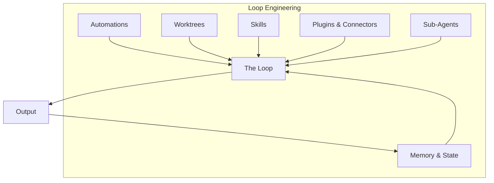

# Loop Engineering Components

```mermaid
flowchart TB
    subgraph Loop Engineering
        A[Automations] --> E[The Loop]
        B[Worktrees] --> E
        C[Skills] --> E
        D[Plugins & Connectors] --> E
        F[Sub-Agents] --> E
        G[Memory & State] --> E
    end
    E --> H[Output]
    H --> G
```
