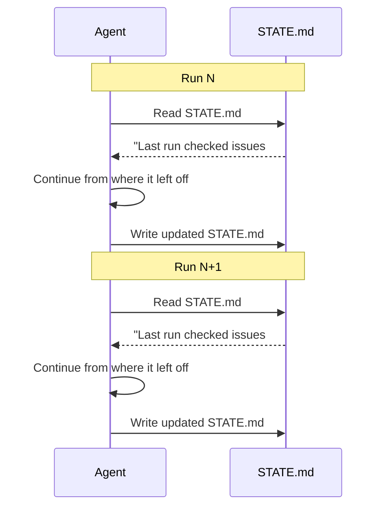

# Loop Memory Flow

```mermaid
sequenceDiagram
    participant Agent
    participant State as STATE.md

    Note over Agent,State: Run N
    Agent->>State: Read STATE.md
    State-->>Agent: "Last run checked issues #1-15, passed #12"
    Agent->>Agent: Continue from where it left off
    Agent->>State: Write updated STATE.md

    Note over Agent,State: Run N+1
    Agent->>State: Read STATE.md
    State-->>Agent: "Last run checked issues #1-25, passed #12, #23"
    Agent->>Agent: Continue from where it left off
    Agent->>State: Write updated STATE.md
```
