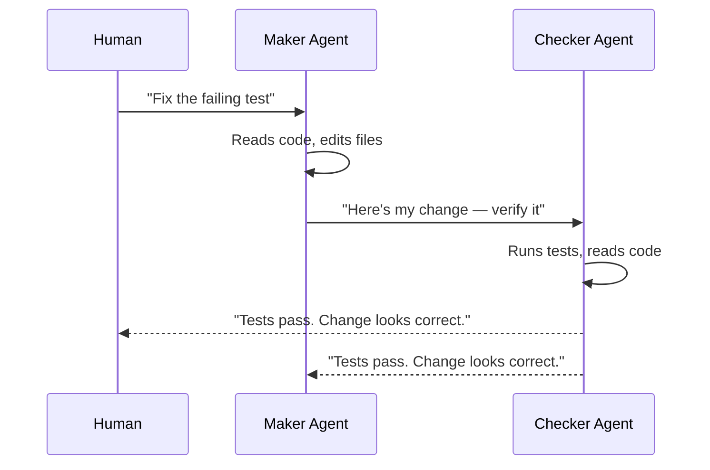

# Maker/Checker Pattern

```mermaid
sequenceDiagram
    participant Human
    participant Maker as Maker Agent
    participant Checker as Checker Agent

    Human->>Maker: "Fix the failing test"
    Maker->>Maker: Reads code, edits files
    Maker->>Checker: "Here's my change — verify it"
    Checker->>Checker: Runs tests, reads code
    Checker-->>Human: "Tests pass. Change looks correct."
    Checker-->>Maker: "Tests pass. Change looks correct."
```
