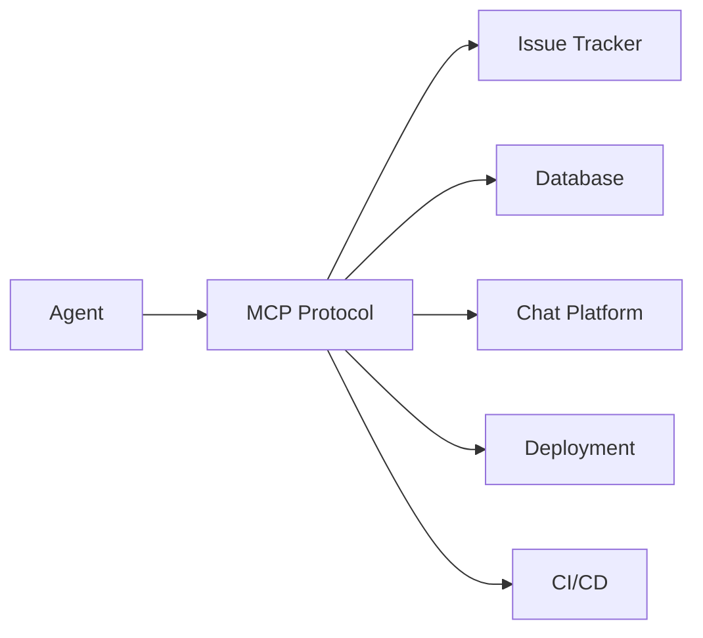

# MCP Plugin Architecture

```mermaid
flowchart LR
    A[Agent] --> M[MCP Protocol]
    M --> T1[Issue Tracker]
    M --> T2[Database]
    M --> T3[Chat Platform]
    M --> T4[Deployment]
    M --> T5[CI/CD]
```
