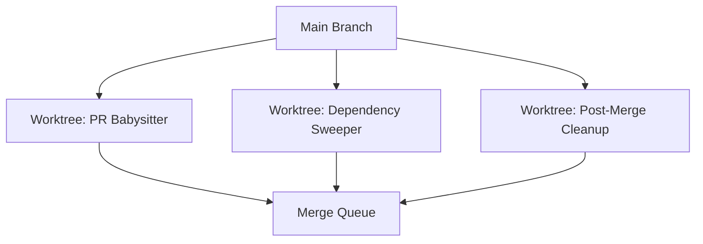

# Multi-Loop Coordination with Worktrees

```mermaid
flowchart TB
    M[Main Branch] --> W1[Worktree: PR Babysitter]
    M --> W2[Worktree: Dependency Sweeper]
    M --> W3[Worktree: Post-Merge Cleanup]
    W1 --> MR[Merge Queue]
    W2 --> MR
    W3 --> MR
```
