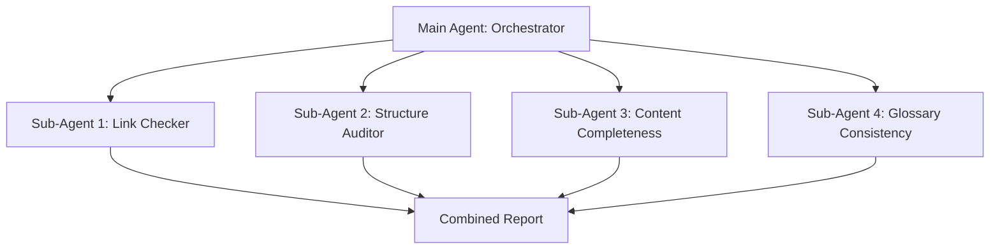

# Multi-Sub-Agent Architecture

```mermaid
flowchart TB
    M[Main Agent: Orchestrator] --> S1[Sub-Agent 1: Link Checker]
    M --> S2[Sub-Agent 2: Structure Auditor]
    M --> S3[Sub-Agent 3: Content Completeness]
    M --> S4[Sub-Agent 4: Glossary Consistency]
    S1 --> R[Combined Report]
    S2 --> R
    S3 --> R
    S4 --> R
```
