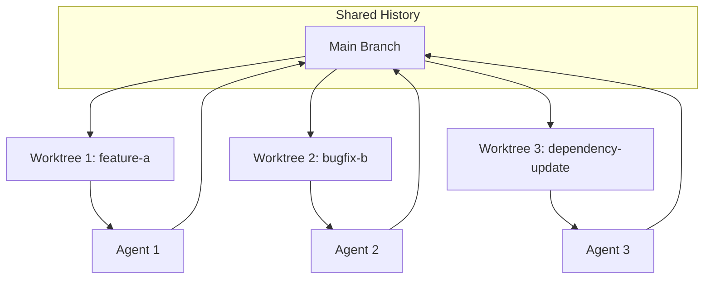

# Worktree Isolation

```mermaid
flowchart TB
    subgraph Shared History
        M[Main Branch]
    end
    M --> W1[Worktree 1: feature-a]
    M --> W2[Worktree 2: bugfix-b]
    M --> W3[Worktree 3: dependency-update]
    W1 --> A[Agent 1]
    W2 --> B[Agent 2]
    W3 --> C[Agent 3]
    A --> M
    B --> M
    C --> M
```
