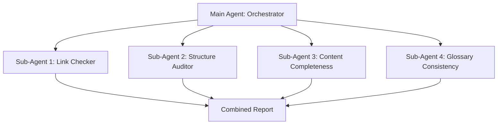

# Skill: Code Quality Guardian

> **Usage:** Runs four independent sub-agents to verify code quality, security, documentation completeness, and link validity across a repository.

---

## Project Conventions

- **Language:** Markdown (this is a learning repo, not software)
- **Framework:** N/A
- **Package Manager:** N/A
- **Test Framework:** N/A
- **Linting:** Markdown linting ( mdl, markdownlint)
- **Formatting:** Consistent heading hierarchy, GitHub-flavored Markdown

## Build Steps

```bash
# No build required — this is a report-only loop
# Prerequisites: git, markdownlint (optional), link checker (optional)
```

## Things Not to Do (and Why)

- **Do not modify source files** — this loop reads and reports only
- **Do not create commits** — writes reports only
- **Do not modify git history** — reads only
- **Do not merge pull requests** — advisory only

## Sub-Agent Architecture

This loop uses four independent sub-agents running in parallel:



Each sub-agent:
1. Reads the repository independently
2. Checks its specific domain
3. Writes findings to a separate report file
4. The orchestrator combines all reports into a final summary

## Notes

- This is a demonstration of the maker/checker pattern with multiple independent checkers
- Each sub-agent uses a different model (haiku for simple checks, sonnet for analysis)
- The loop is L1 (report only) — no files are modified
- Total token cost: ~$0.15-0.30 per full run (4 sub-agents + orchestrator)
