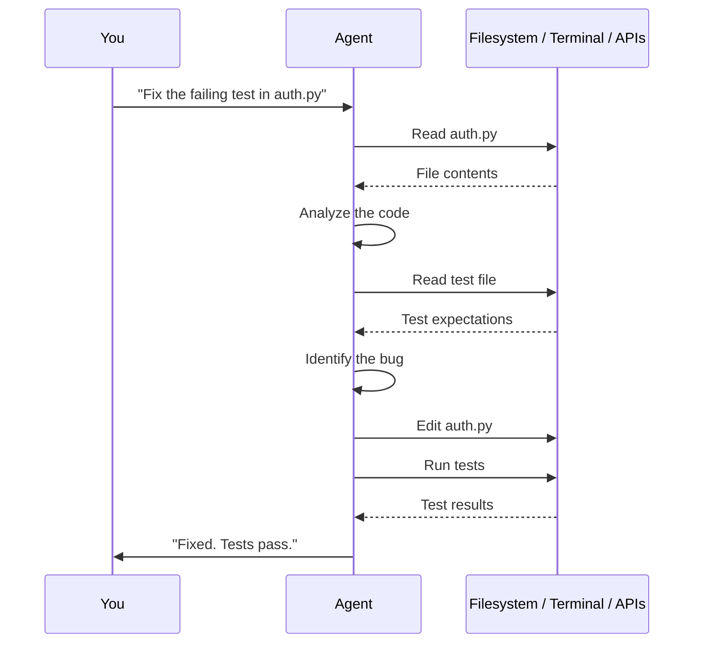

# Module 01: What is an AI Coding Agent

> **A plain-English introduction to agents, prompts, and how they differ from chatbots.**

---

## The Short Version

A **chatbot** generates text in response to your messages. You type, it replies. You type again, it replies again. Every exchange is independent — it doesn't remember the last conversation unless you paste the context back in.

An **AI coding agent** does something fundamentally different: it can **take actions** in the real world. It can read your files, edit code, run commands, search your codebase, and make decisions about what to do next — all without you typing each step.

The difference matters. A chatbot tells you how to fix a bug. A coding agent fixes the bug.

---

## What is a Prompt?

A **prompt** is any text you give to an AI model to instruct it. When you type "fix the bug in main.py" into a coding agent, that's a prompt.

Prompts can be simple:
```
Add a newline at the end of README.md
```

Or complex:
```
Read the test suite in tests/, identify any failing tests, 
diagnose why they fail, fix the implementation in src/ without 
changing the test expectations, and run the tests to confirm 
they pass.
```

The skill of writing effective prompts is called **prompt engineering** — but in the context of coding agents, it's just the beginning. Loop engineering is about designing the system that writes the prompts for you.

---

## How a Coding Agent Works

When you give a coding agent a task, here's what happens under the hood:



Key points:

1. **The agent reads before it writes.** It inspects your codebase to understand context.
2. **The agent decides what tools to use.** You don't tell it to "read file X" — you tell it to "fix the bug" and it figures out which files to read.
3. **The agent iterates.** If the first fix doesn't work, it tries again. This is the loop — and it's where loop engineering begins.
4. **The agent reports back.** It tells you what it did and whether it succeeded.

---

## Agents vs. Chatbots: A Comparison

| Feature | Chatbot | Coding Agent |
|---------|---------|--------------|
| Reads your files | No | Yes |
| Edits your code | No | Yes |
| Runs terminal commands | No | Yes |
| Searches your codebase | No | Yes |
| Remembers across sessions | Limited | Via external state (see [Module 03](../03-the-five-building-blocks/06-memory-and-state.md)) |
| Takes autonomous action | No | Yes |
| Requires your approval for each step | Always | Configurable (L1/L2/L3) |

---

## What is Prompt Engineering?

Prompt engineering is the practice of writing instructions that get the desired behavior from an AI model. For a chatbot, this means crafting the right question. For a coding agent, this means writing clear, specific task descriptions.

Good prompts for coding agents are:

- **Specific**: "Fix the null pointer exception in UserService.java line 42" beats "fix the bug"
- **Bounded**: "Refactor the login function — do not change the public API" beats "refactor the login code"
- **Verifiable**: "Run the test suite after making the change" beats "make it better"

Prompt engineering matters. But in loop engineering, **you stop being the person who writes the prompt every time.** Instead, you design the system that generates the prompt automatically. That's the shift.

---

## The Key Insight

When you use a coding agent interactively, you are the prompter:

```
You: "Fix the bug"
Agent: "Fixed."
You: "Now update the tests"
Agent: "Updated."
You: "Now deploy"
Agent: "Deployed."
```

Each step requires you to decide what happens next, write the prompt, and evaluate the output. You are the human in the loop.

Loop engineering asks: **what if you designed the system that generates those prompts instead?**

```
System: "Run the daily triage loop"
Agent (autonomously): Reads issues, categorizes them, drafts responses, flags urgent items
Human: Reviews the output
```

That's the transition from prompt engineering to loop engineering. You move from writing prompts to designing systems.

---

## Try It Yourself

**Goal:** Experience the difference between interactive prompting and an agent loop.

**Steps:**
1. Open your coding agent.
2. Give it an interactive task: "Read the README.md in the current directory and summarize it."
3. Note how you had to decide what to ask.
4. Now give it a bounded autonomous task: "Read all markdown files in the current directory, list any that contain TODO or FIXME, and write a summary to todo-report.md."
5. Note how the agent read multiple files, made decisions about what to include, and wrote output — without you specifying each step.

**Success condition:** You produced a `todo-report.md` file (it may be empty if no TODOs exist). You experienced the agent taking multiple actions from a single instruction.

---

**Previous:** [Module 00 — Prerequisites](../00-prerequisites/README.md)
**Next:** [Module 02 — What is Loop Engineering](../02-what-is-loop-engineering/README.md)
