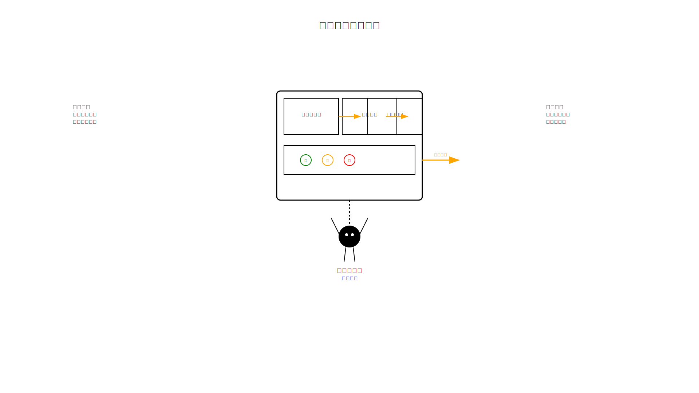
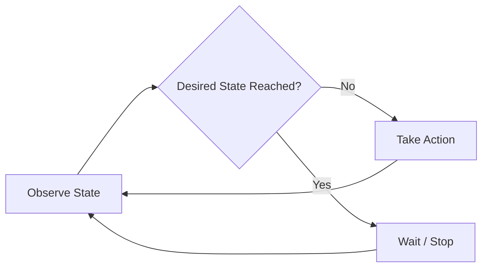
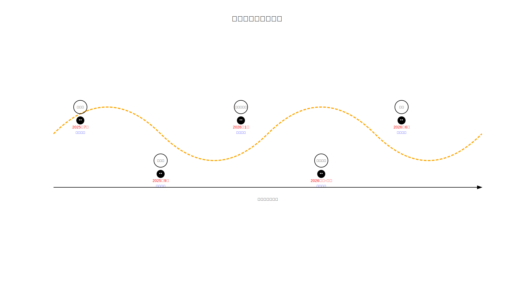
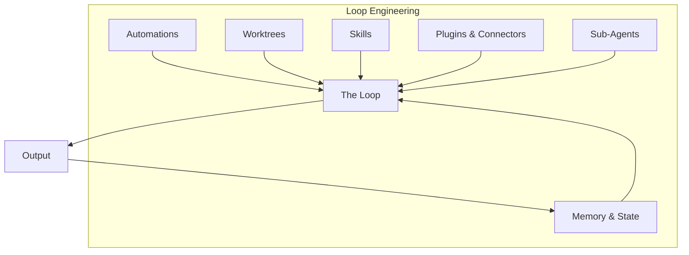

# Module 02: What is Loop Engineering

> **The discipline of designing systems that prompt your AI coding agents — named, structured, and approximately two weeks old.**

---

## The Short Version

**Loop engineering is replacing yourself as the person who prompts the agent — designing the system that does it instead.**

When you interactively type prompts into a coding agent, you are the human in the loop. Loop engineering removes you from that loop — not by replacing you, but by designing the automation, verification, and state management that lets the agent run autonomously.

Think of it like this:

- **Prompt engineering** = you are a manager who gives instructions to an employee, one task at a time.
- **Loop engineering** = you are a systems designer who builds the machine that gives instructions.

The employee analogy helps: a prompt engineer says "do this, then do that." A loop engineer designs the checklist, the schedule, the verification process, and the escalation rules — and then the employee (agent) follows the system.

---

## The Thermostat Analogy

The underlying pattern is not new. It's a **control loop** — the same shape as a thermostat:

1. **Observe** the current state (temperature / codebase status)
2. **Compare** to a desired state (target temperature / passing tests)
3. **Act** if there's a difference (turn on heat / fix the code)
4. **Wait** and repeat

Thermostats, Kubernetes controllers, CI retry systems, and TCP congestion control all use this same shape. Loop engineering applies it to AI coding agents.

**The shape is old. The integration is new.**

---

## The Timeline

Loop engineering did not appear out of nowhere. It emerged through a specific sequence of events:

| When | Who | What Happened |
|------|-----|---------------|
| July 2025 | Geoffrey Huntley | Published "Ralph Wiggum as a 'Software Engineer'" — the technique of wrapping a coding agent in a bash `while true` loop, piping in a prompt file, and letting it run unattended with state persisted to disk |
| September 2025 | Geoffrey Huntley | Ran the technique unattended for three months. The agent built a small esoteric programming language called CURSED as a stress test |
| January 2026 | Geoffrey Huntley | Published "everything is a ralph loop" — arguing the pattern is becoming the default way to work |
| Early–mid 2026 | Daisy Hollman, Boris Cherny (Anthropic) | Formalized the Ralph pattern into an official Claude Code plugin (`/ralph-loop`, `/cancel-ralph`, `/help`), using the stop-hook mechanism instead of an external bash process |
| June 2, 2026 | Boris Cherny (Anthropic) | Speaking at WorkOS-hosted "Acquired Unplugged": "My job is to write loops." He no longer prompts Claude directly |
| June 7–8, 2026 | Peter Steinberger | Posted on X: "You shouldn't be prompting coding agents anymore. You should be designing loops that prompt your agents." View counts varied by source, roughly 2.2M–6.5M |
| June 8, 2026 | Addy Osmani (Google) | Published the essay "Loop Engineering" on Substack, naming and structuring the trend into five building blocks + memory |
| The following week | Community | Term stabilized; open-source tooling, debate threads, and explainer posts appeared within days |

---

## What Makes It "New"?

The skeptics make a fair point: control loops are decades old. You could argue that a cron job running a script is the same thing. And they're right — the **shape** isn't new.

What's arguably new is that the **scaffolding shipped simultaneously**:

1. **Native scheduling** — coding agents that can schedule their own runs without external cron
2. **Native worktrees** — isolated working directories that prevent parallel agents from colliding
3. **Native sub-agents** — built-in verification with a separate model checking the first model's work
4. **Native cross-session memory** — durable state files that persist across agent runs

Before mid-2026, you had to build all of this infrastructure yourself. Now it ships inside the two most-used coding agent products. That integration is what makes it a distinct practice rather than just "a cron job."

---

## Core Definition

> **Loop engineering** is replacing yourself as the person who prompts the agent — designing the system that does it instead. A loop is a recursive goal: define a purpose, and the agent iterates until it's complete, often with sub-agents, verification, and external state.
>
> — Addy Osmani, June 8, 2026

The key words:

- **Recursive goal**: The agent doesn't just execute one instruction. It works toward a condition (e.g., "all tests pass") and keeps iterating until that condition is met.
- **Sub-agents**: A second agent verifies the first agent's work, splitting the roles of maker and checker.
- **External state**: Information persists between runs in files, not in the model's memory.

---

## The Six Components

Loop engineering is built from six components (five building blocks + memory):

These are covered in detail in [Module 03: The Five Building Blocks](../03-the-five-building-blocks/README.md).

---

## What Loop Engineering Is Not

- **It is not prompt engineering.** Prompt engineering is writing good prompts. Loop engineering is designing the system that generates prompts.
- **It is not just automation.** A cron job that runs a script is automation. A loop that observes, decides, acts, verifies, and iterates is more than automation.
- **It is not a replacement for human judgment.** The human defines the goal, sets the guardrails, and reviews the output. The loop runs the process.
- **It is not an established field with years of best practice.** As of mid-June 2026, it's approximately two weeks old. See [HONESTY.md](../../HONESTY.md).

---

## Try It Yourself

**Goal:** Recognize loop engineering thinking in a task you already do.

**Steps:**
1. Think of a task you do regularly with a coding agent (e.g., "review PRs," "update dependencies," "check for security issues").
2. Write down the steps you take each time:
   - What do you check first?
   - What do you do if you find a problem?
   - What does "done" look like?
   - How do you verify the result?
3. Now reframe those steps as a loop:
   - **Observe**: What does the agent check?
   - **Condition**: What is the agent looking for?
   - **Act**: What does the agent do when it finds something?
   - **Verify**: How does the agent confirm its work is correct?
   - **Repeat**: Under what conditions does the loop continue?

**Success condition:** You have described a familiar task as a loop with at least four of the five components (observe, condition, act, verify, repeat). You don't need to build anything yet — just think in loops.

---

**Previous:** [Module 01 — What is an AI Coding Agent](../01-what-is-an-ai-coding-agent/README.md)
**Next:** [Module 03 — The Five Building Blocks](../03-the-five-building-blocks/README.md)
