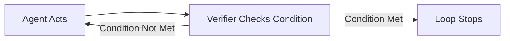

# Automations

> **Scheduled or triggered runs that turn a single agent session into an ongoing loop.**

---

## Plain English

An automation is the "on switch" for your loop. Without it, you have to manually start the agent every time. With it, the loop runs on its own — every morning at 9am, every 15 minutes during business hours, or whenever a specific event happens.

Think of it like an alarm clock for your agent. You set the schedule, the agent wakes up, does its work, and writes the results down.

---

## Technical Detail

Automations in loop engineering come in three forms:

### 1. External Scheduling (Cron / GitHub Actions)

The most common approach for L1 and L2 loops. A cron job or CI/CD pipeline triggers the agent at a set interval.

**GitHub Actions example** (daily run):
```yaml
name: Daily Triage Loop
on:
  schedule:
    - cron: '0 9 * * *'  # 9am UTC daily
  workflow_dispatch:       # manual trigger

jobs:
  triage:
    runs-on: ubuntu-latest
    steps:
      - uses: actions/checkout@v4
      - name: Run triage agent
        run: |
          claude --prompt-file prompts/triage.md \
                 --state-file STATE.md \
                 --output-file reports/triage-$(date +%Y-%m-%d).md
```

### 2. Built-In Scheduling

Claude Code and Codex offer native scheduling features. These are simpler to configure and don't require external CI/CD.

### 3. Event-Driven Triggers

The loop runs in response to an event — a new PR, a failing test, a dependency update. More complex than time-based scheduling, but more responsive.

**GitHub Actions example** (PR trigger):
```yaml
name: PR Babysitter
on:
  pull_request:
    types: [opened, synchronize]

jobs:
  review:
    runs-on: ubuntu-latest
    steps:
      - uses: actions/checkout@v4
      - name: Review PR
        run: claude --prompt-file prompts/review-pr.md
```

---

## The Goal-Condition Primitive

A critical safety mechanism: after each agent turn, a **separate, smaller model** checks whether a stated condition is actually true.

Why this matters: the agent that does the work should not be the agent that decides the work is done. A model can claim "all tests pass" without actually running the tests. A goal-condition primitive runs the verification independently.



This is not just a best practice — it's the difference between a loop that reliably converges and one that spins forever claiming success.

---

## How It Fails If Skipped

Without automations, your loop is a one-shot exercise. You run it manually, get a result, and forget to run it again. The value of loop engineering comes from repetition — the loop running consistently, catching things over time.

---

## Try It Yourself

**Goal:** Set up a basic automation for a report-only loop.

**Steps:**
1. Create a file called `prompts/triage.md` with a simple prompt: "Read all open issues in this repository and write a summary to reports/triage.md."
2. Create a GitHub Action or cron job that runs this prompt once daily.
3. Confirm the action runs (or simulate it by running the command manually).

**Success condition:** You can trigger the agent's triage task without typing the prompt manually — either on a schedule or via a one-command trigger.

---

**Previous:** [Building Blocks Overview](README.md)
**Next:** [Worktrees](02-worktrees.md)
