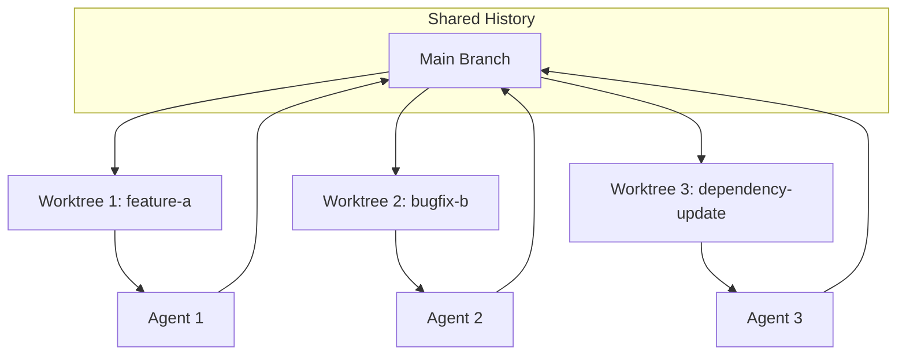

# Worktrees

> **Isolated working directories on their own branch, so parallel agents can't collide on the same files.**

---

## Plain English

A worktree is like giving each agent its own copy of the project to work on. Two agents can edit different files at the same time without stepping on each other's toes. When they're done, their changes get merged back.

Without worktrees, two agents editing the same file at the same time would create conflicts — or worse, one agent would overwrite the other's changes silently.

---

## Technical Detail

Git worktrees let you check out multiple branches simultaneously in different directories. Each worktree has its own working directory but shares the same git history.



### Creating a Worktree

```bash
# Create a new worktree on a new branch
git worktree add ../project-feature-a -b feature-a

# Create a worktree on an existing branch
git worktree add ../project-bugfix bugfix-branch
```

### Why This Matters for Loops

When you run multiple loops on the same repository:

- **PR Babysitter** checks every 15 minutes
- **Dependency Sweeper** runs every 6 hours
- **CI Sweeper** runs every 10 minutes

Each needs its own isolated workspace. Without worktrees, they'd all edit the same working directory, creating unpredictable conflicts.

### Native Support

Both Claude Code and Codex support worktrees natively. The agent can create, switch between, and clean up worktrees without manual git commands.

---

## How It Fails If Skipped

Two parallel loops editing the same files will produce merge conflicts, silent overwrites, or corrupted state. Even with a single loop, if the loop needs to try multiple approaches, worktrees prevent one attempt from polluting another.

---

## When You Need Worktrees

- You have 2+ loops running simultaneously on the same repo
- A single loop needs to try multiple approaches in parallel
- You want to test a loop's changes before merging them

For your first loop (L1, report-only), you probably don't need worktrees yet. They become important when you have multiple loops or move to L2+.

---

## Try It Yourself

**Goal:** Create an isolated worktree for experimentation.

**Steps:**
1. Navigate to any git repository.
2. Run: `git worktree add ../loop-test-worktree -b loop-test`
3. Verify the new directory exists and contains the project files.
4. Make a change in the worktree directory (edit any file).
5. Verify the change does NOT appear in your original directory.
6. Clean up: `git worktree remove ../loop-test-worktree`

**Success condition:** You confirmed that changes in the worktree are isolated from the original directory. You cleaned up the worktree afterward.

---

**Previous:** [Automations](01-automations.md)
**Next:** [Skills](03-skills.md)
