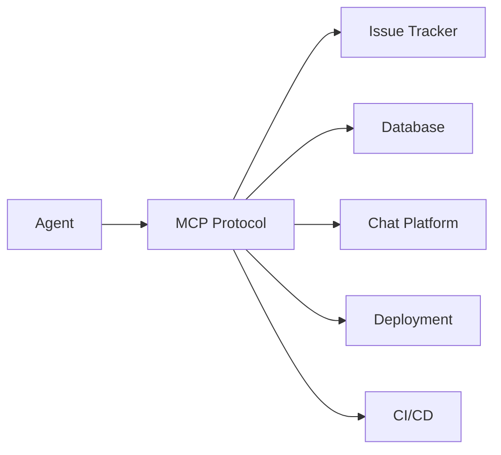

# Plugins & Connectors

> **Built on MCP (Model Context Protocol) — let an agent reach real tools instead of just the filesystem.**

---

## Plain English

A coding agent can read and edit files. But most development work involves more than files: you check issue trackers, read databases, post updates to chat, deploy to servers. Plugins and connectors let the agent reach those tools.

Without plugins, the loop is limited to what it can do with files and terminal commands. With plugins, the loop can interact with the real world — checking Jira, updating a database, posting to Slack, triggering a deployment.

---

## Technical Detail

### Model Context Protocol (MCP)

MCP is a standard that defines how AI agents connect to external tools. It provides a common interface so that any agent can use any tool, regardless of the specific agent or tool implementation.

### Common Plugins

| Plugin Type | What It Lets the Agent Do |
|-------------|--------------------------|
| Issue Tracker | Read, create, update, and comment on issues (GitHub, Jira, Linear) |
| Database | Query and modify data directly |
| Chat | Post messages, read threads (Slack, Discord) |
| Deployment | Trigger deploys, check status, roll back |
| CI/CD | Read build status, trigger pipelines, review test results |

### Configuration

Plugins are typically configured in the agent's settings or in a project-level config file. The exact format depends on your agent tool.

---

## How It Fails If Skipped

Without plugins, the loop is blind to everything outside the filesystem. It can't check if a PR has been reviewed, read the latest issue from a stakeholder, verify a deployment succeeded, or post an update to the team.

This means the loop either:
- Does only file-based work (limited)
- Requires a human to bridge the gap (defeats the purpose)
- Writes a report that someone else has to act on (less useful)

---

## When You Need Plugins

For your first loop, you probably don't need plugins. File-based loops (reading code, writing reports) are the safest starting point.

Plugins become important when:
- The loop needs to interact with external systems (checking CI, reading issues)
- The loop's output needs to go somewhere other than a file (posting to chat, updating a dashboard)
- The loop needs to verify something that can't be checked by reading files (is the deployment running? did the tests pass in CI?)

---

## Try It Yourself

**Goal:** Identify what plugins your ideal loop would need.

**Steps:**
1. Think of a loop you'd like to build (beyond the simple file-based ones).
2. List every external system the loop would need to interact with.
3. For each system, ask: does an MCP plugin exist for this? (Check your agent's documentation.)
4. Note which plugins are essential vs. nice-to-have.

**Success condition:** You have a list of external systems your loop needs, and you know whether MCP plugins exist for each one.

---

**Previous:** [Skills](03-skills.md)
**Next:** [Sub-Agents](05-sub-agents.md)
