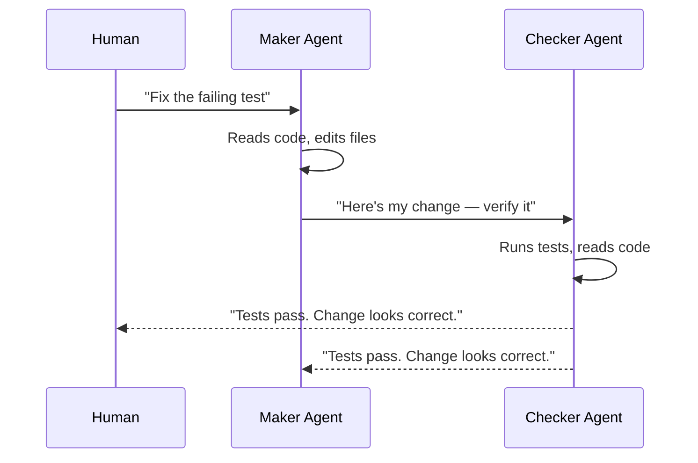

# Sub-Agents

> **A second, independent agent that verifies the first agent's work — splitting "maker" from "checker."**

---

## Plain English

When you ask an agent to fix a bug, it will do its best — and then tell you it succeeded. But how do you know it actually succeeded? The agent that did the work is the same one judging whether the work is correct. That's like letting a student grade their own exam.

A sub-agent is a second agent — sometimes a different model — that independently checks the first agent's output. The first agent (the **maker**) does the work. The second agent (the **checker**) verifies it.

---

## Technical Detail

### The Maker/Checker Pattern

### Why a Separate Agent?

1. **Different model, different blind spots.** If the maker uses a powerful model, the checker can use a different model that catches different issues.
2. **No self-grading.** The maker cannot convince itself that a wrong answer is right.
3. **Independent verification.** The checker runs its own tests, reads its own context, and reaches its own conclusion.

### Configuration

Sub-agents are defined in configuration files. See [templates/subagent-definition.toml.template](../../templates/subagent-definition.toml.template) for a template.

Key fields:
- **name**: Identifier for the sub-agent
- **description**: What this sub-agent does
- **instructions**: Detailed behavior guidelines
- **model/effort**: Which model to use and how much compute to allocate

---

## How It Fails If Skipped

Without sub-agents, the loop relies on the maker agent's self-assessment. This means:
- Errors the maker doesn't recognize slip through
- The agent may claim success when it hasn't actually verified the output
- Confidence without accuracy becomes the default

This is the most dangerous failure mode because **it's invisible.** The loop appears to be working. The agent reports success. But nobody independent checked.

---

## When You Need Sub-Agents

- **L2+ loops** — any loop that proposes or makes changes needs independent verification
- **High-stakes tasks** — security fixes, database migrations, deployment changes
- **Multi-step tasks** — where errors in early steps compound in later steps

For L1 (report-only) loops, sub-agents are optional — the human reviews the output anyway.

---

## Try It Yourself

**Goal:** Experience the difference between self-assessment and independent verification.

**Steps:**
1. Write a short piece of code (a function, a script, anything).
2. Ask your coding agent: "Review this code for bugs." Note its assessment.
3. Now ask a different agent (or the same agent with a fresh session and different prompt): "Here is some code and the previous agent's review. Find any bugs the first review missed."
4. Compare the two assessments.

**Success condition:** You saw the second agent identify at least one thing the first agent didn't mention. (This is not guaranteed, but it demonstrates the value of independent verification.)

---

**Previous:** [Plugins & Connectors](04-plugins-and-connectors.md)
**Next:** [Memory & State](06-memory-and-state.md)
