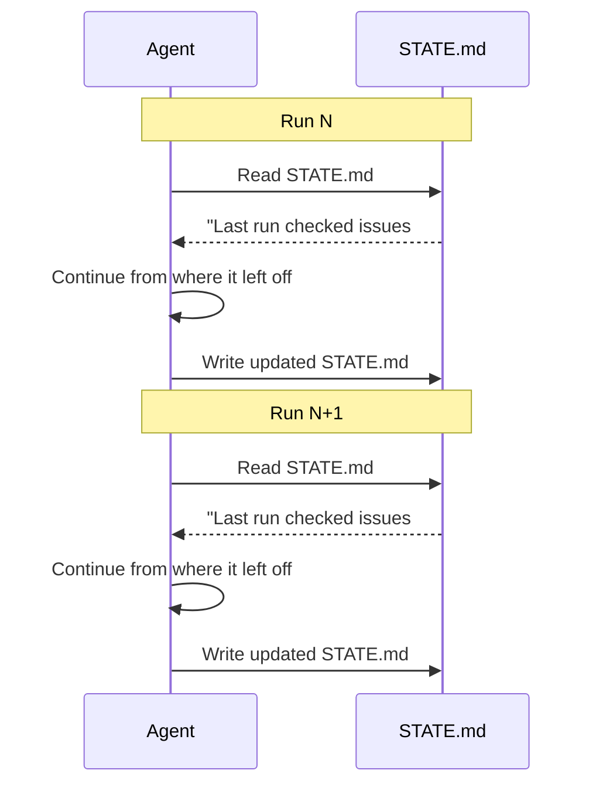

# Memory & State

> **A durable file outside any single conversation, since the model itself forgets everything between runs.**

---

## Plain English

AI models don't remember previous conversations. Every time you start a new session, the model starts from zero. This is fine for interactive use — you paste in context as needed. But for loops, it's a problem.

A loop that forgets everything between runs will:
- Repeat the same work it did last time
- Repeat the same mistakes
- Never learn what worked and what didn't

Memory and state solve this by storing information in a file that persists between sessions. The agent reads the file at the start of each run and writes to it at the end.

---

## Technical Detail

### The STATE.md File

The most common approach is a markdown file (conventionally `STATE.md`) that tracks:

| Section | Purpose |
|---------|---------|
| **Tried** | What approaches have been attempted |
| **Passed** | What has been verified as working |
| **Still Open** | What remains to be done |
| **Last Run Timestamp** | When the loop last ran |

See [templates/STATE.md.template](../../templates/STATE.md.template) for a fill-in-the-blank version.

### How It Works in Practice

### State vs. Memory

- **State** is structured: "what happened, what's next, when did it last run."
- **Memory** is unstructured: "what the agent learned, patterns it noticed, context it needs."

In practice, both live in the same file. The distinction matters conceptually — state is operational, memory is contextual — but you don't need separate files for both.

### Other Approaches

Some projects use:
- **Project boards** (GitHub Projects, Linear) as external state
- **Databases** for structured state
- **Multiple markdown files** for different aspects of state

The simplest approach (one STATE.md file) is usually sufficient for most loops.

---

## How It Fails If Skipped

Without memory/state:
- The loop starts from zero every run — no continuity
- The loop repeats work it already completed
- The loop repeats mistakes it already made
- There's no record of what the loop has done
- Debugging is impossible because there's no history

This is the most fundamental building block. **Every loop needs some form of persistent state.**

---

## Try It Yourself

**Goal:** Create a minimal state file for a hypothetical loop.

**Steps:**
1. Create a `STATE.md` file using [templates/STATE.md.template](../../templates/STATE.md.template).
2. Fill in the sections with hypothetical data (imagine you ran a triage loop that checked 10 issues).
3. "Run" the loop again mentally: read the STATE.md, decide what to do next based on what it says.
4. Update the STATE.md with new information from this hypothetical second run.

**Success condition:** You can read the STATE.md and immediately understand what the loop did, what it found, and what it should do next. A second person reading the file could pick up where the loop left off.

---

**Previous:** [Sub-Agents](05-sub-agents.md)
**Next:** [Module 04 — Building Your First Loop](../04-building-your-first-loop/README.md)
