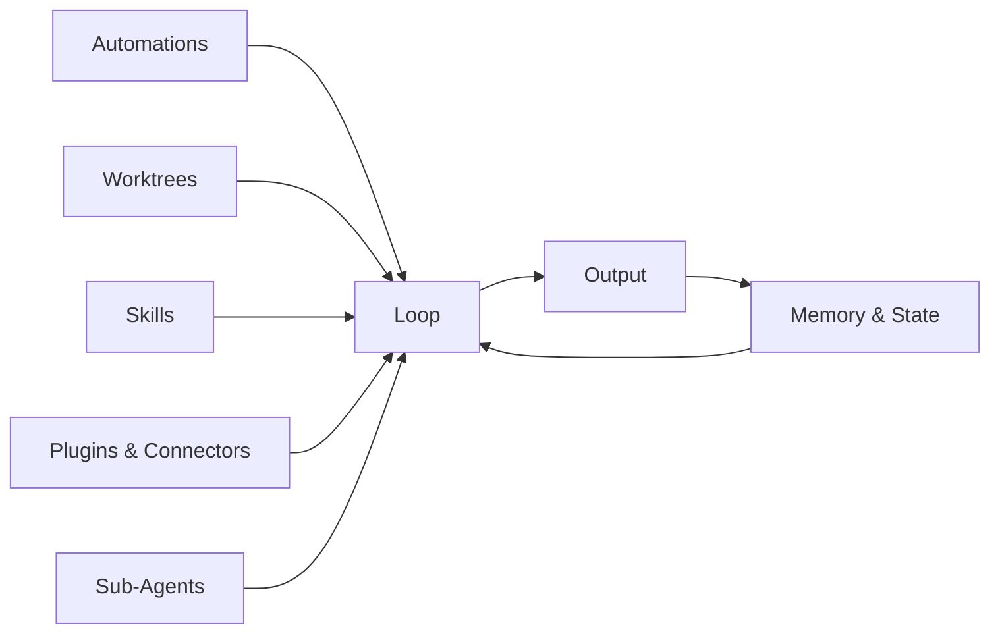

# Module 03: The Five Building Blocks

> **The six components that make up a loop engineering system — automations, worktrees, skills, plugins & connectors, sub-agents, and memory/state.**

---

## The Short Version

A loop is not one thing. It's a system built from six components. You don't need all six for your first loop, but understanding them helps you design loops that scale.

| Component | What It Does |
|-----------|-------------|
| [Automations](01-automations.md) | Triggers the loop on a schedule or event |
| [Worktrees](02-worktrees.md) | Isolates parallel agents so they don't collide |
| [Skills](03-skills.md) | Gives the agent project context so it doesn't re-derive everything from scratch |
| [Plugins & Connectors](04-plugins-and-connectors.md) | Lets the agent reach real tools beyond the filesystem |
| [Sub-Agents](05-sub-agents.md) | Verifies the agent's work with a separate checker |
| [Memory & State](06-memory-and-state.md) | Persists information across agent runs |

---

## How They Compose

A minimal loop needs only two components: **memory/state** (so the agent remembers what it did) and **automations** (so the loop runs without you). Everything else improves reliability, safety, or capability.

A production loop typically uses four or five. The most common starter kit:

1. **Memory/state** — a `STATE.md` file tracking what's been tried and what's still open
2. **Automations** — a scheduled run (daily, every few hours, etc.)
3. **Skills** — a `SKILL.md` file with project conventions
4. **Sub-agents** — a verifier that checks the primary agent's work

Worktrees matter most when you have multiple loops running in parallel on the same repo. Plugins matter when the loop needs to interact with external systems (issue trackers, databases, deployment platforms).

---

## The Minimum Viable Loop

For your first loop (you'll build one in [Module 04](../04-building-your-first-loop/README.md)), you need:

- A **prompt file** (what the agent should do)
- A **state file** (what the agent remembers between runs)
- A **scheduling mechanism** (how the loop runs)

That's it. Automations + memory. Everything else can come later.

---

## How They Fail If Skipped

| Component | What Goes Wrong Without It |
|-----------|---------------------------|
| Automations | The loop only runs when you remember to start it manually |
| Worktrees | Parallel agents overwrite each other's changes |
| Skills | The agent re-derives project context every run, wasting tokens and making inconsistent decisions |
| Plugins | The loop can only read/write files — no access to issues, databases, or deployment |
| Sub-Agents | The agent grades its own work — errors slip through |
| Memory & State | The agent forgets everything between runs, repeating work or repeating mistakes |

---

## Learn Each Component

Each building block has its own module with a plain-English explanation, technical detail, and examples:

1. [Automations](01-automations.md)
2. [Worktrees](02-worktrees.md)
3. [Skills](03-skills.md)
4. [Plugins & Connectors](04-plugins-and-connectors.md)
5. [Sub-Agents](05-sub-agents.md)
6. [Memory & State](06-memory-and-state.md)

---

## Try It Yourself

**Goal:** Identify which building blocks your first loop will need.

**Steps:**
1. Think of a simple, low-risk task you want to automate (e.g., "check for outdated dependencies once a day").
2. For each building block, ask: does my loop need this?
   - **Automations**: Do I want it to run without me starting it manually? (Probably yes.)
   - **Worktrees**: Will multiple loops run on the same repo simultaneously? (Probably not for your first loop.)
   - **Skills**: Does the agent need project-specific context? (Probably yes — even a short SKILL.md helps.)
   - **Plugins**: Does the loop need to interact with anything outside the filesystem? (Probably not for your first loop.)
   - **Sub-Agents**: Does the output need independent verification? (Maybe — but L1 loops are low-risk enough to skip this initially.)
   - **Memory & State**: Does the agent need to remember what it did last time? (Almost certainly yes.)

**Success condition:** You have identified 2–4 building blocks for your planned loop. You understand why each one is (or isn't) needed.

---

**Previous:** [Module 02 — What is Loop Engineering](../02-what-is-loop-engineering/README.md)
**Next:** [Automations](01-automations.md)
