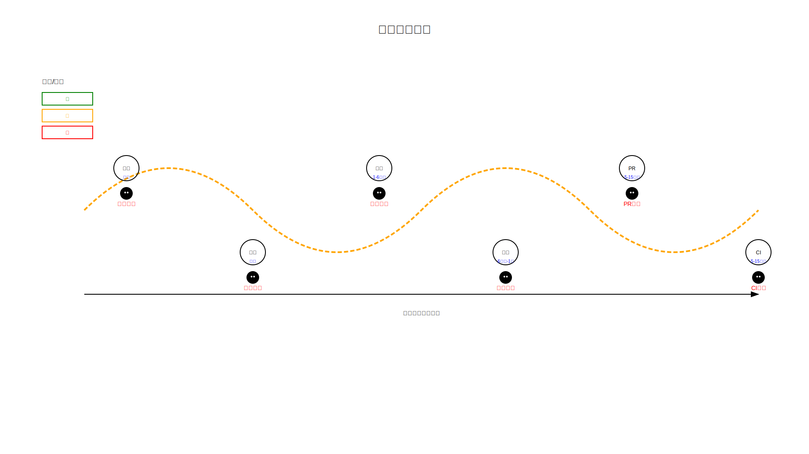

# Module 06: Production Patterns

> **Six battle-tested loop patterns — from low-cost daily reports to high-frequency PR monitoring.**

---

## The Six Patterns

| Pattern | Cadence | Starting Maturity | Relative Token Cost | Description |
|---------|---------|-------------------|---------------------|-------------|
| [Daily Triage](#daily-triage) | Once a day | L1 | Low | Categorizes issues, PRs, and activity |
| [PR Babysitter](#pr-babysitter) | Every 5–15 min | L1 (watch only) | High | Monitors pull requests for review readiness |
| [CI Sweeper](#ci-sweeper) | Every 5–15 min | L2 (cautious) | Very high | Checks CI status, flaky tests, build health |
| [Dependency Sweeper](#dependency-sweeper) | 6h–1 day | L2 (patch-only) | Medium | Proposes dependency updates |
| [Changelog Drafter](#changelog-drafter) | Daily / per-release | L1 (draft) | Low | Drafts changelogs from git history |
| [Post-Merge Cleanup](#post-merge-cleanup) | 1–6h | L1 (off-peak) | Low | Cleans up after merges |

---

## Daily Triage

**What it does:** Reads open issues, PRs, and recent activity. Categorizes by priority, labels, and assignee status. Writes a summary report.

**Cadence:** Once daily (morning recommended)

**Starting maturity:** L1

**Token cost:** Low

**Worked example:** See [examples/daily-triage/](../../examples/daily-triage/)

**Why it's useful:** Gives the team a single daily snapshot of what needs attention. Catches stale issues before they become problems.

---

## PR Babysitter

**What it does:** Monitors open pull requests. Checks for: review readiness (all required reviews approved), CI status (all checks passing), merge conflicts, stale PRs (no activity for N days).

**Cadence:** Every 5–15 minutes

**Starting maturity:** L1 (watch only — reports status, doesn't act)

**Token cost:** High (frequent runs, many files to check)

**Why it's useful:** Prevents PRs from sitting unreviewed, catches CI failures early, flags merge conflicts before they compound.

**Caution:** High token cost. Start at L1 with a long interval (15 min) and reduce only if the value is proven.

---

## CI Sweeper

**What it does:** Checks CI build status across all active branches. Identifies flaky tests, failing builds, and performance regressions. May propose fixes for simple failures (retries, dependency issues).

**Cadence:** Every 5–15 minutes

**Starting maturity:** L2 (cautious — proposes fixes, human merges)

**Token cost:** Very high (frequent runs, test analysis)

**Why it's useful:** Catches CI issues before they block development. Identifies flaky tests that waste developer time.

**Caution:** This is the highest-risk, highest-cost pattern. Requires proven L1 monitoring first. Only move to L2 after the monitoring loop has been accurate for weeks.

---

## Dependency Sweeper

**What it does:** Checks for outdated dependencies. Proposes updates with changelogs and compatibility notes. Runs tests to verify the update doesn't break anything.

**Cadence:** Every 6 hours to once daily

**Starting maturity:** L2 (patch-only — proposes, human merges)

**Token cost:** Medium

**Why it's useful:** Keeps dependencies current without manual effort. Catches security vulnerabilities in dependencies early.

**Caution:** Start with patch-level updates only (1.2.3 → 1.2.4). Minor and major version updates carry more risk and should be handled manually until the loop is proven.

---

## Changelog Drafter

**What it does:** Reads git history, categorizes commits by type, and drafts a changelog. Writes a report — changes nothing.

**Cadence:** Daily or per-release

**Starting maturity:** L1 (draft)

**Token cost:** Low

**Worked example:** See [examples/changelog-drafter/](../../examples/changelog-drafter/)

**Why it's useful:** Saves the manual work of writing changelogs. Ensures no meaningful change is forgotten.

**This is the recommended first loop.** It's the pattern used in [Module 04](../04-building-your-first-loop/README.md).

---

## Post-Merge Cleanup

**What it does:** After a PR is merged, runs cleanup tasks: formatting code, updating generated documentation, removing dead code, running linters with auto-fix.

**Cadence:** Every 1–6 hours (or triggered by merge events)

**Starting maturity:** L1 (off-peak — reports what needs cleanup)

**Token cost:** Low

**Why it's useful:** Keeps the codebase clean without manual housekeeping. Prevents small issues from accumulating.

**Caution:** Start with report-only. Only enable auto-fix for truly safe operations (formatting, linting) after extensive L1 validation.

---

## How to Choose a Pattern

1. **Start with Changelog Drafter or Daily Triage.** Lowest risk, lowest cost, immediate value.
2. **Add patterns gradually.** Don't run all six at once.
3. **Match the pattern to your biggest pain point.** If PRs sit unreviewed, try PR Babysitter. If dependencies are stale, try Dependency Sweeper.
4. **Respect the starting maturity.** Don't start a pattern at L2 unless L1 is proven.

---

## Try It Yourself

**Goal:** Choose a second pattern to add to your loop portfolio.

**Steps:**
1. Review the six patterns above.
2. Identify which one addresses your biggest current pain point.
3. Fill out `templates/first-loop-design-canvas.md` for that pattern.
4. Set it up at L1 and run it for at least 3 days before evaluating.

**Success condition:** You have a second loop running at L1, producing useful output, that you can evaluate after a few days.

---

**Previous:** [Module 05 — The Maturity Model](../05-the-maturity-model/README.md)
**Next:** [Module 07 — What Goes Wrong](../07-what-goes-wrong/README.md)
