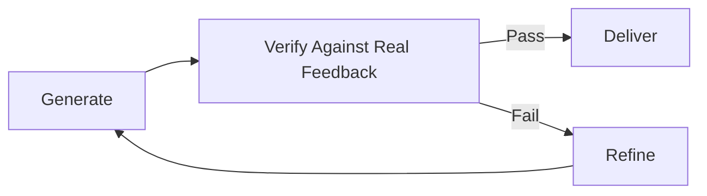

# Beyond Coding

> **The generate→verify against real feedback→refine→ repeat pattern isn't coding-specific.**

---

## The Pattern

Loop engineering's core pattern — generate output, verify it against objective criteria, refine based on feedback, repeat — applies far beyond software.

The pattern:

This is not a coding-specific pattern. It's a general-purpose quality loop. The reason it works for coding (tests provide objective verification) also works for other domains where objective feedback exists.

---

## Example: Document-to-Presentation

**Single-shot approach (current default):**
1. Write a prompt: "Turn this document into a presentation"
2. Get a result
3. Maybe refine once or twice
4. Deliver

**Loop approach:**
1. **Generate** an outline from the document
2. **Verify** each claim against the source document (does the presentation accurately represent the source?)
3. **Render** slides from the verified outline
4. **Check** claims against source again (did the rendering introduce inaccuracies?)
5. **Revise** if discrepancies found
6. **Repeat** until all claims are verified

The loop version is more reliable because it verifies at each step, not just at the end.

---

## Other Domains

### Writing
- Generate a draft
- Verify factual claims against sources
- Check for logical consistency
- Revise
- Repeat

### Data Analysis
- Generate a visualization
- Verify the data against the source
- Check for misleading representations
- Revise
- Repeat

### Design
- Generate a layout
- Verify against accessibility standards
- Check for visual consistency
- Revise
- Repeat

### Research
- Generate a literature review
- Verify citations against original sources
- Check for missing references
- Revise
- Repeat

---

## Why Loops Work Better Than Single-Shot

The core insight: **verification is cheap, quality is expensive.**

A single-shot generation relies on the model getting everything right in one pass. This is unreliable for complex tasks. A loop separates generation from verification, allowing each to be done well.

The key requirement: **objective verification criteria.** If you can't define "done" in terms a machine can check, the loop can't converge. This is why loops work so well for coding (tests are objective) and less well for creative tasks (quality is subjective).

---

## When to Use Loops Beyond Coding

Use the loop pattern when:
- The task can be broken into generate/verify steps
- Verification can be at least partially automated
- The cost of errors is high enough to justify iteration
- A single pass is unlikely to produce correct output

Don't use the loop pattern when:
- The task is inherently creative and subjective
- Verification requires human judgment (a human is the verifier anyway)
- The task is simple enough that a single pass is reliable
- The cost of iteration exceeds the cost of getting it wrong

---

## Try It Yourself

**Goal:** Apply the loop pattern to a non-coding task.

**Steps:**
1. Choose a task you do regularly (writing, analysis, research).
2. Define the generate/verify/refine cycle for that task.
3. Identify what "verified" means — what objective criteria can you check?
4. Write a prompt that implements one cycle of the loop.

**Success condition:** You have a prompt that generates output and includes a verification step with objective criteria. You can imagine running this prompt repeatedly until the output passes verification.

---

**Previous:** [Token Economics](token-economics.md)
**Next:** [Module 10 — Capstone Project](../10-capstone-project/README.md)
