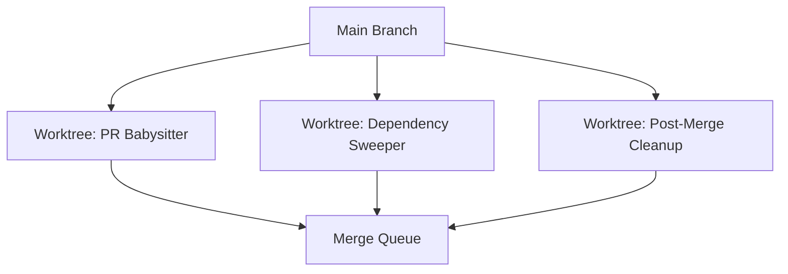

# Multi-Loop Coordination

> **When two loops touch the same branch or files, chaos follows. Here's how to prevent it.**

---

## The Problem

You have:
- A **PR Babysitter** checking every 15 minutes
- A **Dependency Sweeper** running every 6 hours
- A **Post-Merge Cleanup** running every 2 hours

All three loops operate on the same repository. If they all run at the same time, they can:
- Edit the same files simultaneously
- Create conflicting branches
- Overwrite each other's changes
- Produce merge conflicts

---

## Coordination Strategies

### 1. File-Level Ownership

Each loop owns specific files. If a loop needs to edit a file it doesn't own, it waits or escalates.

| Loop | Owned Files |
|------|-------------|
| PR Babysitter | Read-only (no file edits) |
| Dependency Sweeper | `package.json`, `go.mod`, `requirements.txt`, lock files |
| Post-Merge Cleanup | Formatting, linting, generated docs |

### 2. Worktree Isolation

Each loop runs in its own worktree. Changes are isolated until explicitly merged.



### 3. Time-Based Coordination

Schedule loops so they don't overlap. If the Dependency Sweeper runs at 6am, the Post-Merge Cleanup runs at 8am, and the PR Babysitter runs continuously (read-only), there's no collision window.

### 4. Lock Files

A simple coordination mechanism: a `.loop-lock` file that indicates which loop is currently running.

```
# .loop-lock
active_loop: dependency-sweeper
started_at: 2026-06-20T09:00:00Z
```

Other loops check this file before starting. If it exists and the timestamp is recent, they wait.

**Caveat:** Lock files work for sequential loops. They don't help with parallel loops that need to run simultaneously.

### 5. Branch Naming Conventions

Each loop creates branches with predictable prefixes:

```
loop/pr-babysitter/1234
loop/dependency-sweeper/update-lodash
loop/post-merge-cleanup/format-abc123
```

This makes it clear which loop created which branch and prevents naming collisions.

---

## The Coordination Checklist

Before running multiple loops on the same repo:

- [ ] Each loop's file ownership is defined
- [ ] Loops use worktrees or branch naming conventions
- [ ] Schedule overlaps are identified and resolved
- [ ] A merge order is defined (which loop's changes merge first?)
- [ ] Rollback for each loop is independent (one loop's failure doesn't break others)

---

## When to Worry About This

- You have 2+ loops that write to the same branch
- You have loops that edit overlapping files
- You've experienced a merge conflict caused by two loops

For most loop portfolios, file-level ownership and worktree isolation are sufficient. Lock files and time-based coordination are overkill until you have many loops running simultaneously.

---

## Try It Yourself

**Goal:** Map the file ownership for your loops.

**Steps:**
1. List all loops you currently run (or plan to run).
2. For each loop, list the files it reads and writes.
3. Identify any overlapping writes.
4. Assign ownership (which loop "owns" each file?).
5. For overlapping writes, decide: worktree isolation, time separation, or merge order?

**Success condition:** You have a clear ownership map for every file your loops touch. No two loops write to the same file without a coordination strategy.

---

**Previous:** [Advanced Topics Overview](README.md)
**Next:** [Token Economics](token-economics.md)
