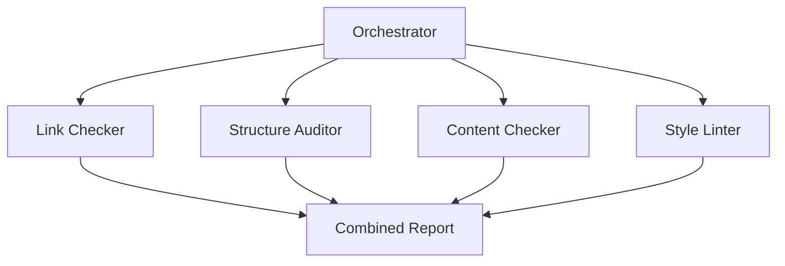

# Project 05: Multi-Agent Auditor

> Build a loop with 4 independent sub-agents running in parallel.

---

## Goal

Run a loop where 4 sub-agents independently audit your repository for different issues.

## What This Loop Does

1. **Sub-Agent 1 (Link Checker):** Validates all internal markdown links
2. **Sub-Agent 2 (Structure Auditor):** Verifies directory structure
3. **Sub-Agent 3 (Content Checker):** Checks for required sections in docs
4. **Sub-Agent 4 (Style Linter):** Checks markdown formatting consistency
5. Combines findings into a single report
6. Updates `STATE.md`

## What This Loop Never Does

- Never modifies source code
- Never creates commits
- Never modifies markdown files

## Architecture



## Setup

```bash
cd /path/to/your-repo
cp -r /path/to/everything-about-loop-engineering/projects/project-05-multi-agent-auditor/* .
mkdir -p reports
```

## Run

```bash
claude --prompt-file prompt.md
```

## Success Criteria

- [ ] 4 sub-agent reports exist in `reports/`
- [ ] Combined report exists at `reports/multi-agent-audit.md`
- [ ] Each sub-agent found at least one finding (or confirmed clean)
- [ ] `STATE.md` is updated
- [ ] No files were modified
