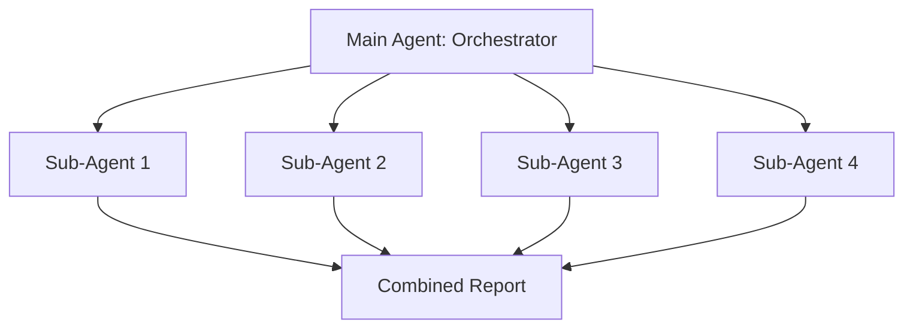

# Skill: Code Quality Guardian

> **Usage:** Runs multiple independent sub-agents to verify code quality, security, documentation, and consistency across a repository.

---

## Project Conventions

- **Type:** Multi-sub-agent loop (L1) — report only
- **Output:** Combined report in `reports/quality-audit.md`
- **Frequency:** Daily or weekly
- **Token cost:** Medium (~$0.15–$0.30/run for 4 sub-agents)

## Architecture



## Sub-Agent Definitions

### Sub-Agent 1: Link Checker
- Checks all internal markdown links
- Reports broken links with file path and line number
- Uses: read-only access to all .md files

### Sub-Agent 2: Structure Auditor
- Verifies directory structure matches the spec
- Reports missing or extra files
- Uses: directory listing, file existence checks

### Sub-Agent 3: Content Completeness
- Checks module READMEs for required sections
- Reports missing diagrams, examples, exercises
- Uses: read access to module files

### Sub-Agent 4: Glossary Consistency
- Checks term usage across all files
- Reports inconsistent spellings/variants
- Uses: grep/search across all .md files

## Prompt Template (Orchestrator)

```markdown
You are a code quality orchestrator. Launch 4 sub-agents in parallel 
to audit this repository.

## Sub-Agent Tasks

1. **Link Checker:** Check all internal markdown links. Report broken 
   links with file path and line number.

2. **Structure Auditor:** Verify the directory structure matches the 
   required spec. Report missing or extra files.

3. **Content Completeness:** Check all module READMEs for: short intro, 
   plain English explanation, technical detail, Mermaid diagram, 
   worked example, "Try it yourself" exercise.

4. **Glossary Consistency:** Check that key terms (loop engineering, 
   coding agent, sub-agent, worktree, L1/L2/L3) are used consistently 
   across all files.

## Rules
- Each sub-agent writes to a separate report file
- Do NOT modify source files
- Combine all findings into a final summary
```

## Verification Condition

All 4 sub-agent reports exist in `reports/` directory, and a combined summary exists at `reports/quality-audit.md`.

## Scaling

- Add more sub-agents for additional checks (security scanning, performance analysis, accessibility)
- Use different models: haiku for simple checks (link validation), sonnet for analysis (content completeness)
- Run orchestrator on schedule, sub-agents on-demand
