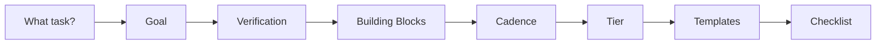

# Skill: Loop Designer

> **Usage:** Helps humans design new loops by walking them through the design canvas, checklist, and template selection process.

---

## Project Conventions

- **Type:** Advisory skill (not a loop itself)
- **Output:** Completed templates in the user's project
- **Frequency:** On-demand (when designing a new loop)
- **Token cost:** Low (single conversation)

## What This Skill Does

1. Asks the user what task they want to automate
2. Walks them through the design canvas
3. Helps them select the right building blocks
4. Recommends a maturity tier
5. Generates the required files (SKILL.md, STATE.md, prompt file)
6. Runs the pre-flight checklist

## Design Flow

## Questions to Ask

1. **What should the loop accomplish?** (One sentence)
2. **How do you know it succeeded?** (Objectively checkable)
3. **How often should it run?** (Cadence)
4. **What files does it need to read/write?** (Scope)
5. **Does it need external tools?** (Plugins/connectors)
6. **Does the output need independent verification?** (Sub-agents)
7. **Does it need to remember previous runs?** (Memory/state)
8. **What's the maximum you'll spend?** (Budget)
9. **How do you stop it?** (Kill switch)
10. **Who reads the output?** (Owner)

## Template Selection

| Need | Template |
|------|----------|
| First loop | `templates/first-loop-design-canvas.md` |
| Project setup | `templates/SKILL.md.template`, `templates/VISION.md.template`, `templates/AGENTS.md.template` |
| Loop state | `templates/STATE.md.template` |
| Sub-agents | `templates/subagent-definition.toml.template` |
| Pre-launch | `templates/loop-design-checklist.md` |
| Claude Code | `templates/claude-code-automation.example.md` |
| Codex | `templates/codex-automation.example.md` |

## Maturity Recommendation

| Evidence | Recommended Tier |
|----------|-----------------|
| First time building a loop | L1 |
| Task is read-only | L1 |
| L1 running successfully for 1+ week | Consider L2 |
| Task is narrow-scope and reversible | L2 |
| L2 running successfully for 2+ weeks | Consider L3 |
| Task has proven automated verification | L3 |

## Common First Loops

1. **Changelog Drafter** — Lowest risk, lowest cost, immediate value
2. **Daily Triage** — Good for teams with many issues/PRs
3. **Dependency Sweeper** — Good for projects with many dependencies
4. **Code Quality Guardian** — Good for demonstrating sub-agent pattern
